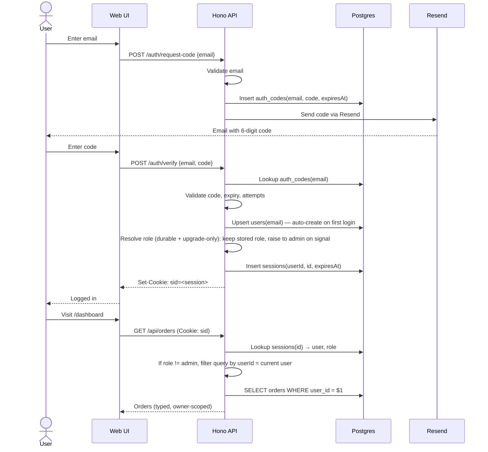

# Vibe Starter — Backend Design

> Hono + PostgreSQL + Drizzle + Resend + pino + zod, with Stripe for payments. Auth, access control, structured logging, and validated environment ship as primitives — not exercises left to the builder.

This document covers the backend stack. For project-level decisions, see [`PROJECT_DESIGN.md`](./PROJECT_DESIGN.md). For frontend, see [`FRONTEND_DESIGN.md`](./FRONTEND_DESIGN.md). For tooling, see [`TOOLING_DESIGN.md`](./TOOLING_DESIGN.md).

---

## Decision summary

| Decision               | Choice                                                                 | Primary alternative considered                           |
| ---------------------- | ---------------------------------------------------------------------- | -------------------------------------------------------- |
| API framework          | **Hono**                                                               | Express, Fastify, Koa                                    |
| Database               | **PostgreSQL**                                                         | Redis-only, MySQL, SQLite, DynamoDB                      |
| ORM / query builder    | **Drizzle**                                                            | Prisma, raw `pg`, Kysely                                 |
| Local DB orchestration | **Docker Compose**                                                     | Railway local agent, dev container                       |
| Auth                   | **Magic-link via Resend**                                              | Username/password, OAuth-only, Auth0/Clerk               |
| Session storage        | **Postgres `sessions` table**                                          | Redis, JWT, signed cookies                               |
| CSRF protection        | **Origin header check + `SameSite=Lax` cookies**                       | Double-submit cookie, CSRF token middleware              |
| Rate limiting          | **Postgres-backed fixed window on auth endpoints**                     | Redis token bucket, in-memory counter                    |
| Tenancy                | **Single-tenant; ownership rule (`userId` filter) on user-owned rows** | Multi-tenant `tenantId` FK, schema-per-tenant            |
| Roles / RBAC           | **Two roles (`admin`/`user`) + `requireRole()` middleware**            | Casbin, OPA, ad-hoc checks                               |
| Payments               | **Stripe (hosted Checkout + webhooks)**                                | PayPal, Lemon Squeezy / Paddle (MoR), Square             |
| Email                  | **Resend**                                                             | SendGrid, Postmark, AWS SES                              |
| Logging                | **pino**                                                               | winston, bunyan, console                                 |
| Env validation         | **zod**                                                                | envalid, manual checks                                   |
| Error handling         | **Hono `onError` middleware**                                          | Per-route try/catch                                      |
| Background work        | **In-process periodic worker (`runPeriodically`)**                     | pg-boss, DIY `SKIP LOCKED` queue, no background work     |
| Backend testing        | **Vitest + integration tests via in-memory `app.request()`**           | Jest, node:test, unit-only testing, throwaway containers |

---

## API framework: Hono

### Decision

**Hono** as the HTTP framework.

### Why

**1. TypeScript-native.** Hono was designed for TypeScript from day one. Express's types are community-maintained DefinitelyTyped declarations bolted onto a JavaScript-first API. The difference shows up immediately in route handlers — `c.req.valid('json')` returns the validated, narrowed type from the validator middleware; Express's `req.body` is `any` until you add manual type assertions.

**2. Validator integration.** `@hono/zod-validator` plugs directly into the request pipeline. Validation failures return structured 400 errors automatically. Equivalent in Express requires choosing a validator, choosing how to integrate it, and writing the glue.

**3. RPC client.** Hono exports its app's type signature via `AppType`. The `hc<AppType>('/')` client gives the frontend typed, autocomplete-ed access to every endpoint. Frontend and backend share types end-to-end without code generation. Express has nothing equivalent.

**4. Runtime portability.** Hono runs on Node, Bun, Deno, Cloudflare Workers, and Vercel Edge. We're committed to Node + Railway today, but the optionality is free.

**5. Smaller surface area.** Hono's API is tighter than Express's. Less to teach, less to misuse. Middleware composition is cleaner. The agent picks correct patterns more reliably.

**6. Strong agent training data.** Hono's docs are clean and its patterns are consistent, so the agent generates idiomatic routes and middleware on the first try.

### Concrete comparison: same endpoint, both frameworks

**Express:**

```typescript
import express from 'express';
const app = express();
app.use(express.json());

app.post('/api/bookings', (req, res) => {
	// req.body is `any`. We don't know its shape.
	const { note, serviceId } = req.body;

	// Manual validation:
	if (typeof serviceId !== 'number') {
		return res.status(400).json({ error: 'serviceId required' });
	}
	if (typeof note !== 'string' || note.length === 0) {
		return res.status(400).json({ error: 'note required' });
	}

	// ...persist, then respond
	res.json({ id: 1, note, serviceId });
});
```

**Hono:**

```typescript
import { Hono } from 'hono';
import { zValidator } from '@hono/zod-validator';
import { z } from 'zod';

const bookingSchema = z.object({
	note: z.string().min(1),
	serviceId: z.number().int().positive(),
});

const app = new Hono().post('/api/bookings', zValidator('json', bookingSchema), (c) => {
	const { note, serviceId } = c.req.valid('json');
	// ^ fully typed: { note: string; serviceId: number }
	// Validation failures are auto-returned as 400 with structured error.
	return c.json({ id: 1, note, serviceId });
});

export type AppType = typeof app; // <-- exported for the RPC client
```

**On the frontend:**

```typescript
import { hc } from 'hono/client';
import type { AppType } from '../../server/app';

const api = hc<AppType>('/');

// Typed end-to-end. TS errors if `serviceId` is missing or wrong shape.
const res = await api.api.bookings.$post({
	json: { note: 'First-time visitor', serviceId: 7 },
});
const booking = await res.json(); // typed as { id: number; note: string; serviceId: number }
```

A field rename in the schema lights up red across the entire codebase — frontend and backend. This is the slop-prevention lever working as intended.

### Alternatives considered

**Express.** Industry standard, ubiquitous training data. Rejected because its TypeScript story is bolted-on, the RPC pattern doesn't exist, and validator integration requires bespoke glue.

**Fastify.** Fast, has a schema-first philosophy. Rejected because its TypeScript story, while better than Express, is less polished than Hono's, and the RPC client equivalent (`@fastify/type-provider-typebox`) is more ceremony.

**Koa.** Smaller than Express but still fundamentally JS-first. No advantages over Hono.

### Trade-offs

Hono is younger than Express. The community is smaller and growing fast; some edge cases (multipart form parsing, sticky sessions across instances) require checking source. For side-project scale, this is fine.

### When to revisit

Hono losing momentum or major maintainer departure. Currently neither is in evidence.

---

## Database: PostgreSQL + Drizzle

This is the most contested decision in the starter. The argument for Redis-only persistence is real and deserves a real response.

### Decision

**PostgreSQL** as the primary data store, accessed via the **Drizzle ORM**. Postgres locally via Docker Compose; Postgres on Railway in production via the one-click add-on. **Redis is documented as an escape hatch** for sessions, rate-limiting, or job queues if a specific project legitimately needs it — but not as a primary store.

### Why this matters

The choice of primary data store shapes every other backend decision. It determines:

- How the agent reasons about data (schema-as-code vs. ad-hoc keys)
- How types flow from DB to API to UI (typed columns vs. `JSON.parse(...) as any`)
- How transactions, migrations, and audits work
- How easy it is to introduce authorization bugs

This section is long because the cost of getting it wrong is paid by every project that comes after.

---

### Why Postgres (not Redis-only)

**1. Schema-as-code is the single highest-leverage agent-context lever.**

Drizzle's schema is a TypeScript file. The agent reads it once and knows the shape of every table. Field names, types, constraints, foreign keys, defaults — all visible. (The `bookings`/`services` tables below are _illustrative_ — the kind of thing a project adds; the starter itself ships only the generic tables listed under "Schema sketch" later.)

```typescript
// src/db/schema.ts — schema is the single source of truth (illustrative tables)
export const bookings = pgTable('bookings', {
	id: serial('id').primaryKey(),
	userId: integer('user_id')
		.notNull()
		.references(() => users.id),
	serviceId: integer('service_id')
		.notNull()
		.references(() => services.id),
	note: text('note').notNull(),
	status: bookingStatusEnum('status').notNull().default('pending'),
	createdAt: timestamp('created_at', { withTimezone: true }).notNull().defaultNow(),
	version: integer('version').notNull().default(1), // for optimistic locking
});
```

(Convention: `createdAt` uses `withTimezone: true` — naive `timestamp` columns are a classic foot-gun, so the starter defaults to `timestamptz` for every timestamp.)

There is no equivalent in a Redis-only architecture. Schema in Redis is implicit: it lives across `redis.set()` call sites, ad-hoc `JSON.parse()` shapes, and the heads of whoever built it. New contributors (and AI agents) must reconstruct it from archaeological evidence.

**2. Type-safe queries from end to end.**

```typescript
const myBookings = await db
	.select()
	.from(bookings)
	.where(and(eq(bookings.userId, currentUser.id), eq(bookings.status, 'paid')))
	.orderBy(desc(bookings.createdAt))
	.limit(20);

// myBookings: Booking[] — fully typed. Renaming `status` to `state`
// in the schema lights up every query referencing it.
```

The Redis equivalent loses every typing step:

```typescript
// First, you need to have manually maintained a secondary index.
// Every write to bookings must update this set; if you forget, queries silently
// return stale results.
const ids = await redis.zRange(`bookings:by_user:${userId}:paid`, 0, 19, { REV: true });

const result: any[] = [];
for (const id of ids) {
	const data = await redis.get(`booking:${id}`);
	if (data) result.push(JSON.parse(data));
	// Plus: filter out rows whose status changed but the secondary
	// index wasn't updated yet. Hope you remembered.
}
// result is `any[]` — no type safety, no autocomplete, no compile-time
// catch when the schema changes.
```

The Redis path requires the builder to _invent_ what Postgres provides for free: indexes, joins, type safety, atomic mutations.

**3. Real ACID transactions across rows.**

```typescript
await db.transaction(async (tx) => {
  await tx.insert(bookings).values({...});
  await tx.insert(audit).values({...});
  await tx.update(services).set({ spotsTaken: sql`spots_taken + 1` }).where(...);
});
// All-or-nothing. Postgres handles concurrency.
```

Redis offers `MULTI/EXEC` and Lua scripts, both of which work but operate at the key level, not the relational level. Maintaining cross-key consistency requires hand-rolled patterns — a competence that, when present, is a one-team artifact, not a starter-grade pattern.

**4. Migrations are checked-in artifacts, replayable in any environment.**

```sql
-- src/db/migrations/0007_add_capacity_column.sql
ALTER TABLE services ADD COLUMN capacity integer NOT NULL DEFAULT 10;
```

Generated by `drizzle-kit generate` from a schema change. Committed to git. Replayed automatically on `npm run dev` (via the `predev` hook) and in CI. Every developer's database matches the schema; production matches the schema; staging matches the schema.

Redis has no equivalent. Schema changes are one-off scripts (`for await (const key of redis.scanIterator(...))`) that:

- Run once, with no record they ran (so the next environment re-runs blindly or breaks).
- Have no rollback story.
- Can race with concurrent writes that don't yet have the new field.
- Are inconsistent across environments unless someone remembers to run them.

**5. Relational queries — joins — without manual indexes.**

"Show me all services a given customer has booked, where the service is fully booked, with at least one unpaid booking."

In Drizzle, this is one query with a couple of joins. In Redis, it requires either (a) hand-built secondary indexes for every access pattern (which you must maintain on every write), or (b) full scans (which don't scale even at prototype size).

A Redis-only approach to relational data of this shape needs per-user sorted sets, per-service sorted sets, per-status sorted sets, dedup keys, and Lua scripts to atomically maintain index consistency. **That is exactly the kind of one-team knowledge that does not generalize to a starter consumed by non-engineers.** A vibe coder asking their agent to "filter by date" is not going to invent the matching secondary index; they'll write a key scan, ship it, and watch it break at scale.

**6. The agent is dramatically better at SQL than Redis.**

SQL has 50 years of training data and is declarative. The agent says what it wants; the database figures out how. Drizzle wraps SQL in TypeScript, which the agent handles with even higher fluency.

Redis idioms are procedural, project-specific, and require the agent to know your particular key schema, secondary index conventions, and transaction patterns. Cross-project Redis knowledge does not transfer well — what one app learned about Lua dedup is not what the next side project will need.

**7. Drizzle Studio for non-engineers.**

`npx drizzle-kit studio` opens a local browser UI that lets non-engineers browse and edit data without writing SQL. Useful for "what does my data actually look like" debugging — the kind of question vibe coders ask constantly.

There is no Redis equivalent that's both safe and ergonomic. RedisInsight exists, but exposing its full power to non-engineers (where `FLUSHALL` is one keystroke away) is risky.

---

### Addressing the Redis pushback directly

**"A Redis-with-AOF app works fine. Why not start there?"**

A Redis-only app can work fine when the people building it bring engineering discipline that vibe coders will not have. AOF gives durability (`appendfsync everysec` survives crashes with ≤1s data loss). Lua scripts give atomicity. Sorted sets give time-ordered queries. Building all of that _correctly_ is a credit to a skilled team, not evidence the architecture generalizes.

The starter is consumed by people who will not write Lua scripts, will not maintain secondary indexes consistently, and will not reason about race conditions between `MULTI` blocks. Asking them to is asking for the failure modes Postgres prevents structurally.

**"Redis is cheaper."**

False at our scale.

| Provider | Small Postgres                       | Small Redis                          |
| -------- | ------------------------------------ | ------------------------------------ |
| Railway  | ~$5/mo for 512MB instance            | ~$5/mo for 256MB instance            |
| Neon     | Free tier covers prototype workloads | n/a                                  |
| Upstash  | n/a                                  | Free tier covers prototype workloads |

Both have free tiers that cover prototype workloads. At scale (millions of ops/sec), DynamoDB or managed Redis Enterprise become cost-relevant. We are five orders of magnitude away. Picking a database for a scale ceiling we'll never reach is premature optimization, and the cost is daily friction.

**"Redis is easier."**

True for the simplest case (`SET foo bar`, `GET foo`). False everywhere else.

The "easy" Redis demo doesn't include: designing keyspaces around access patterns, maintaining secondary indexes on every write, writing Lua scripts for atomic operations, handling AOF tuning, recovering from concurrent updates, querying by anything other than the primary key, or running migrations.

The "easy" Postgres demo includes: `CREATE TABLE`, `SELECT * FROM x WHERE y = z`. With Drizzle, the second part is autocompleted in TypeScript. The agent handles both.

The asymmetry: **Redis is easy when your data is genuinely key-value with fixed access patterns.** Most side-project data isn't. Customers with bookings with payments against services is textbook relational data. Forcing it into Redis requires the manual reinvention of relational primitives.

**"DynamoDB is more scalable / managed."**

For our scale, no. DynamoDB requires:

- AWS account setup, IAM roles, billing.
- A local emulator (`dynamodb-local`) for offline development — breaks the "Docker Compose up and you're running" story.
- Designing partition keys and sort keys around access patterns _before_ writing code (because changing them later requires data rewriting).
- Global Secondary Indexes for any non-primary-key query (each one is a separate billable entity).
- Hand-rolled analytics via S3 export + Athena.

For the rare project that truly needs DynamoDB-scale throughput, that's an engineering task, not a starter default.

**"NoSQL is more flexible for evolving schemas."**

This is the most-repeated and least-true argument. Document stores let you change shape _without telling anyone_, but the data still has shape — it just lives in JavaScript objects scattered across the codebase. The flexibility is illusory; you've moved schema enforcement from the database to "whatever happens to read this row next."

Postgres + Drizzle gives you `ALTER TABLE` (in a checked-in migration) for additive changes, JSONB columns for genuinely document-shaped fields, and migration tools for renaming/restructuring. The flexibility you actually want is available; the chaos you don't want is prevented.

---

### Where Redis IS appropriate

The starter does not ship Redis by default, but documents it as an escape hatch for three legitimate use cases:

| Use case                     | Why Redis fits                                                                                                                                                                                                    |
| ---------------------------- | ----------------------------------------------------------------------------------------------------------------------------------------------------------------------------------------------------------------- |
| **Session storage at scale** | If sessions become a bottleneck (rare at prototype scale), Redis's TTL-keyed reads are faster than Postgres lookups. The starter ships sessions in Postgres; promote to Redis only when measured to be a problem. |
| **Rate limiting**            | Token-bucket and sliding-window rate limits naturally fit Redis. Implementing in Postgres is awkward.                                                                                                             |
| **Job queues**               | BullMQ, Bee Queue, or similar. Postgres can do simple queues (`SKIP LOCKED`), but for high-throughput async work, Redis-backed queues are the standard.                                                           |

If a project legitimately needs one of these, the builder adds Redis as a secondary service. They do not move primary data into it.

---

### Drizzle (specifically) over Prisma

Within the "Postgres + ORM" decision, Drizzle was chosen over Prisma. Both are credible.

|                   | Drizzle                                     | Prisma                                         |
| ----------------- | ------------------------------------------- | ---------------------------------------------- |
| Schema location   | TypeScript file                             | `.prisma` DSL                                  |
| Code generation   | None (types inferred)                       | Heavy generated client at build time           |
| Bundle size       | Small                                       | Large (depends on platform)                    |
| Migration tooling | `drizzle-kit generate` + `migrate`          | `prisma migrate dev`                           |
| Agent context     | Schema is just TS — agent reads `schema.ts` | Schema is `.prisma` — agent must learn the DSL |
| Maturity          | Younger (released 2022)                     | Older, more battle-tested                      |
| Community         | Growing fast                                | Larger, more SO answers                        |

The deciding factor: **schema is just TypeScript**. The agent reads `schema.ts` like any other file in the project, types flow naturally, no codegen step. For an agent-first starter, this is significant. Prisma's `.prisma` DSL is one indirection layer the agent has to navigate.

Both produce safe code. Both have good migration stories. Either would work; Drizzle's agent-friendliness tips the balance.

---

## Auth + access control

### Decision

The starter ships a working **magic-link authentication** flow with **session-backed authorization**, **two roles** (`admin` / `user`), and an **ownership rule** for user-owned data, all as primitives. Builders use the scaffold; they do not invent it.

This is a **single-tenant** app: one business, many user accounts (customers self-register and pay for what they want). There is no `tenantId`, no per-tenant isolation, and no cross-tenant model. The access-control surface that matters is simpler and sharper: _can this user touch this row, and can this user reach this route?_

### Architecture



### Components

**1. Magic-link email auth.** No passwords. The user enters their email, receives a 6-digit code via Resend, and submits it. Codes expire after 10 minutes; failed attempts are rate-limited.

Reasoning: passwords are a security liability and a UX cost. Magic links eliminate password storage, password reset flows, and "I forgot my password" support requests. This pattern is well-proven and works well for a consumer audience that just wants to sign up and pay for something.

**2. Open self-signup.** Anyone can request a magic-link code. On the first successful verify, a `user` account is auto-created — customers self-register, no invite required. The app is **not** invite-only; open signup is the default.

```typescript
// On verify success. Roles are durable + UPGRADE-ONLY: a login signal
// (ADMIN_EMAILS membership, or a consumed invite) can RAISE the stored role,
// but absence of a signal preserves it — a returning user is never demoted.
const [existing] = await db.select({ role: users.role }).from(users).where(eq(users.email, email));
const role = await resolveLoginRole(email, existing?.role ?? null);
const [user] = await db
	.insert(users)
	.values({ email, role })
	.onConflictDoUpdate({ target: users.email, set: { role } })
	.returning();
```

**3. Session storage in Postgres.** Sessions are rows in a `sessions` table with `(id, user_id, expires_at, created_at)` columns and a 24-hour TTL with sliding refresh on each request.

Reasoning: rejecting JWTs because they cannot be revoked without an external blacklist (which defeats the point); rejecting Redis because we don't ship Redis by default. Postgres sessions are simple, performant at our scale, and survive a reboot.

**4. Two-role RBAC.** Roles ship as a Postgres enum:

```typescript
export const roleEnum = pgEnum('role', [
	'admin', // can manage all users' data and reach admin-only routes
	'user', // can only access their own rows
]);
```

Roles are **durable and upgrade-only**. The stored `users.role` is the source of truth; a login can only ever _raise_ it, never lower it. On each login the role resolves to the higher-privilege of the stored role and the login _signal_ — and absence of a signal preserves the stored role (so a returning user is never silently demoted).

The `admin` role is reached via two signals: the **`ADMIN_EMAILS`** env allowlist (comma-separated, case-insensitive), and **invites** (the `invites` table). Both only upgrade:

- **`ADMIN_EMAILS` is a bootstrap + break-glass mechanism, not the ongoing management surface.** Membership guarantees a login resolves to _at least_ `admin`; it never demotes. Set it once to mint the first admin, then invite the rest from inside the app. Removing an email from the list does **not** revoke that user's `admin` — revocation is a separate, explicit action (see below).
- **Invites grant a durable role.** An admin invites an email (`POST /api/invites`); the grant applies on that email's next login, when `verifyCode` consumes the one-shot invite. Because the role is now durable, the invited admin stays admin on every subsequent login — no need to also add them to `ADMIN_EMAILS`. Open self-signup is unaffected: an email with no signal is a `user`.

**Revocation (lowering a role) is intentionally out of scope for the base** and is an extension point: add an explicit admin action (e.g. `DELETE /api/users/:id/role` or a "demote" endpoint, gated by `requireRole('admin')`) that writes the lower role directly. It is deliberately NOT a login side effect, so the set of admins can't churn silently as `ADMIN_EMAILS` is edited.

The `requireRole()` middleware gates admin routes:

```typescript
app.post('/api/invites',
  requireRole('admin'),
  zValidator('json', createInviteSchema),
  async (c) => { ... }
);
```

Reasoning: two roles cover almost every side-project need (a business owner who administers everything, and the customers who use it). More complex permission models (per-resource ACLs, role hierarchies) are explicitly deferred — add them only when a project genuinely needs them.

**5. The ownership rule.** Every table of user-owned rows has a `userId` foreign key. Queries against those tables MUST filter by the current user unless the caller is an `admin`:

```typescript
// The idiomatic shape, documented in AGENTS.md and the auth skill.
const rows = await db
	.select()
	.from(orders)
	.where(
		user.role === 'admin'
			? undefined // admins see everything
			: eq(orders.userId, c.var.user.id)
	);
```

**The single most likely high-severity bug a vibe coder ships is broken access control / IDOR** — a user reading or mutating another user's data because a query wasn't scoped to the current user (e.g. a customer viewing another customer's order by guessing an `id`), or a `user` reaching an `admin`-only route. This is the bug the starter most aggressively prevents, via two mechanisms: `requireRole('admin')` on admin routes, and the ownership rule on every user-owned query. The access-control anchor test (see Testing) exists specifically to keep this contract honest.

**6. CSRF protection.** Session cookies use `SameSite=Lax`, `HttpOnly`, and `Secure` (in production). For non-GET requests, the API additionally checks that the `Origin` header matches the configured app origin.

Reasoning: `SameSite=Lax` blocks the common CSRF vectors automatically. The origin check is defense-in-depth for the remaining cases (legacy form submissions, browser edge cases) without the bookkeeping of CSRF tokens. Adequate for same-site cookie auth; revisit if the API ever needs to accept cookie-authenticated requests from a different origin. (The Stripe webhook route is exempt — it is server-to-server, authenticated by signature, not by cookie; see Payments.)

**7. Rate limiting.** Auth endpoints (magic-link request, code verify) are rate-limited via a Postgres-backed fixed-window counter keyed by `(ip, email)`. Defaults: 5 requests per 10 minutes per key, configurable via env. The same `rateLimit({ key, limit, window })` middleware can be mounted on any other endpoint that needs it.

The canonical example is a **public, unauthenticated endpoint that sends email** — e.g. a contact/inquiry form (`POST /api/contact`). Left open, it's a spam-relay and inbox-flood vector, so mount `rateLimit()` (keyed by IP) on it and pair it with a hidden honeypot field that legitimate users never fill. The starter doesn't ship a contact endpoint (what it collects and where it routes is project-specific), but this is exactly the safe composition the first-feature tutorial walks through, on top of the shipped rate limiter and the `email/resend` wrapper.

Reasoning: without rate limiting, the magic-link request endpoint is an email-bomb vector and the verify endpoint is a brute-force vector. Redis isn't shipped by default (see database section), so the limiter uses a small Postgres table with periodic GC. Fast enough at prototype scale; revisit if rate-limit traffic dominates DB load on a specific project.

### Optional escape hatch: multi-tenancy

The starter is deliberately single-tenant, because the representative use case (and most side projects) is one business serving many individual users. **If you ever build a true multi-tenant SaaS** (one deployment serving many independent organizations, each with isolated data), the shape is well-known and you can graduate to it:

- Add a `tenants` table and a `tenantId` foreign key to every tenant-owned table.
- Resolve the current `tenantId` from the session at request time.
- Scope _every_ query by `tenantId` (a `withTenantScope(tenantId)` helper makes this idiomatic), in addition to — not instead of — the ownership rule.
- The highest-severity bug then becomes cross-tenant leakage, and the anchor test grows a "tenant A cannot read tenant B's data" case.

This is documented as a graduation path, like Redis is for the data store. It is **not** shipped by default; do not add it speculatively.

### The `auth` skill

A skill is shipped upfront in the starter at `.agents/skills/auth/SKILL.md` (and equivalent paths for other agent harnesses) documenting:

- How to add a new protected route (use `requireRole('admin')`).
- The role model (`admin` / `user`) — durable + upgrade-only — and how `ADMIN_EMAILS` and invites raise a role to `admin`.
- The ownership rule — user-owned queries always filter by `userId = c.var.user.id` unless the caller is `admin` — with copy-paste examples for read and mutate paths.
- How the auth scaffold is structured (so the agent doesn't reinvent it).
- The optional multi-tenant escape hatch, in case the project grows into a true multi-tenant SaaS.

This remains the **only** skill authored specifically for this starter and shipped pre-written, because auth/access-control is the highest-stakes contract the agent must honor on day one — getting it wrong leaks one customer's data to another or hands a regular user admin powers. Other skills accumulate reactively as patterns recur.

### Alternatives considered

**Auth0, Clerk, Supabase Auth.** External providers offer slick UX and offload security. Rejected because:

- They lock projects into provider-specific session formats.
- Free tiers are limited; a solo builder running a couple of side projects can hit them.
- They add an external dependency to the auth flow — the app can't run end-to-end in `docker compose up`.
- The magic-link flow we want is ~150 lines of code; the value of a third-party provider is less than the integration cost.

**Username/password.** Rejected. Strict liability; no upside vs. magic links.

**OAuth-only (Google, GitHub).** Tempting because it's simple. Rejected because it forces every user to have a specific provider account; magic links work for everyone with email. OAuth can be added later as an alternate sign-in if a project wants it.

---

## Payments: Stripe

### Decision

**Stripe** as the payment provider, integrated by default via **Stripe-hosted Checkout** (a redirect to Stripe's hosted payment page), with **webhooks as the source of truth** for payment status. The representative use case: a customer pays for something — a booking, a class seat, a membership.

This section documents the _design_; it does not include a full implementation. The shape below is what the starter scaffolds and what the `auth`/payments conventions point the agent at.

### Why Stripe

- **Ubiquitous, best agent training data.** Stripe's API and patterns are the most heavily documented and exemplified of any payment provider, so the agent generates correct integration code reliably.
- **Hosted Checkout keeps card data off our servers.** The card form lives on Stripe's domain, so the app never touches raw card numbers — minimal PCI surface for a non-engineer to get wrong.
- **Excellent test mode + CLI.** Test-mode keys and the Stripe CLI make local end-to-end testing (including webhook delivery) trivial, mirroring the rest of the starter's "run it locally" ethos.
- **Robust webhooks.** Signed, redeliverable event delivery is the backbone of a reliable payment integration, and Stripe's is the reference implementation.

### Integration shape

**Default: Stripe Checkout (hosted redirect).** The server creates a Checkout Session and redirects the customer to Stripe's hosted page; Stripe handles the card entry and confirmation, then redirects back to a success/cancel URL.

```typescript
// Sketch: create a Checkout Session for a caller-supplied line item, return its URL.
// The starter ships ONE placeholder purchase ('Sample item') so the flow runs
// end-to-end out of the box — replace it with whatever your project actually sells.
app.post('/api/checkout', requireAuth, async (c) => {
	const session = await stripe.checkout.sessions.create({
		mode: 'payment',
		customer_email: c.var.user.email,
		// Two ways to price a line item — pick whichever fits; the starter bakes in neither:
		//   (1) a pre-created Stripe Price:  line_items: [{ price: 'price_123', quantity: 1 }]
		//   (2) an inline ad-hoc amount (used here for the demo):
		line_items: [
			{
				quantity: 1,
				price_data: {
					currency: 'usd',
					unit_amount: 1000, // $10.00, in the smallest currency unit
					product_data: { name: 'Sample item' },
				},
			},
		],
		success_url: `${env.APP_ORIGIN}/checkout/success?session_id={CHECKOUT_SESSION_ID}`,
		cancel_url: `${env.APP_ORIGIN}/checkout/cancel`,
		metadata: { userId: String(c.var.user.id) },
	});
	// Persist a pending, user-owned order keyed by session.id BEFORE redirecting.
	await db.insert(orders).values({
		userId: c.var.user.id,
		description: 'Sample item',
		stripeCheckoutSessionId: session.id,
		status: 'pending',
		amount: 1000,
		currency: 'usd',
	});
	return c.json({ url: session.url });
});
```

**Recurring memberships: Stripe Billing / subscriptions.** If a project sells a membership rather than a one-off purchase, use `mode: 'subscription'` and Stripe Billing; the `invoice.paid` webhook drives renewal state.

**Escape hatch: Stripe Elements** (`@stripe/react-stripe-js`) if an embedded card form is ever genuinely needed (custom checkout UX). This pulls card data closer to the app and raises the PCI bar, so it is the exception, not the default. See [`FRONTEND_DESIGN.md`](./FRONTEND_DESIGN.md) for the (minimal) frontend payment touchpoint.

### Webhooks are the source of truth

A Hono route `POST /api/stripe/webhook` receives Stripe events and is the **only** place payment status is mutated. The client redirect after Checkout is a UX convenience, never trusted for payment status — a user can close the tab, lose connectivity, or tamper with the redirect.

Two non-negotiables:

**1. Verify the signature against the raw request body.** Stripe signs each event; verification requires the _exact bytes_ Stripe sent. **The gotcha:** do not let any JSON body parser run before verification — parsing and re-serializing changes the bytes and the signature check fails. The webhook route reads the raw body explicitly.

```typescript
app.post('/api/stripe/webhook', async (c) => {
	const sig = c.req.header('stripe-signature');
	const rawBody = await c.req.text(); // raw bytes, NOT c.req.json()
	let event: Stripe.Event;
	try {
		event = stripe.webhooks.constructEvent(rawBody, sig!, env.STRIPE_WEBHOOK_SECRET);
	} catch {
		return c.json({ error: 'invalid signature' }, 400);
	}
	await handleStripeEvent(event); // idempotent — see below
	return c.json({ received: true });
});
```

**2. Handlers must be idempotent.** Stripe redelivers events on timeout or failure, so the same event can arrive more than once. Key the effect on the Stripe event id (or the session/payment-intent id) and make re-processing a no-op:

```typescript
async function handleStripeEvent(event: Stripe.Event) {
  switch (event.type) {
    case 'checkout.session.completed':
    case 'invoice.paid': {
      const sessionId = /* extract from event */;
      // UPDATE ... WHERE status = 'pending' makes the second delivery a no-op.
      await db.update(orders)
        .set({ status: 'paid', stripePaymentIntentId: /* ... */, paidAt: new Date() })
        .where(and(eq(orders.stripeCheckoutSessionId, sessionId), eq(orders.status, 'pending')));
      break;
    }
  }
}
```

On `checkout.session.completed` / `invoice.paid`, the matching `orders` row is marked `paid` (idempotently). Any downstream logic — fulfilling the purchase, sending a confirmation email — hangs off that single transition.

### Schema sketch

A generic, **domain-agnostic** `orders` table (call it `payments` if that reads better) records the _payment facts_ — who paid, how much, the Stripe identifiers, and the status — for a user. It deliberately does **not** reference a domain entity, because what you sell is your project's decision, not the starter's:

```typescript
export const orderStatusEnum = pgEnum('order_status', ['pending', 'paid', 'refunded']);

export const orders = pgTable('orders', {
	id: serial('id').primaryKey(),
	userId: integer('user_id')
		.notNull()
		.references(() => users.id),
	description: text('description').notNull(), // what was bought, e.g. 'Sample item'
	stripeCheckoutSessionId: text('stripe_checkout_session_id').notNull().unique(),
	stripePaymentIntentId: text('stripe_payment_intent_id'),
	status: orderStatusEnum('status').notNull().default('pending'),
	amount: integer('amount').notNull(), // smallest currency unit (e.g. cents)
	currency: text('currency').notNull().default('usd'),
	createdAt: timestamp('created_at', { withTimezone: true }).notNull().defaultNow(),
	paidAt: timestamp('paid_at', { withTimezone: true }),
});
```

The `orders` rows are user-owned, so they obey the ownership rule: a customer sees only their own orders unless the caller is `admin`.

**No domain entity ships.** `createCheckoutSession` takes its line item from the caller, and the starter wires a single placeholder `'Sample item'` purchase so payments work on day one — you replace it with whatever you actually sell. When you have a domain entity (a service, a product, a booking), link it however suits the project: add a nullable foreign-key column to `orders` (e.g. `serviceId`), or stash the reference in `description` / Stripe `metadata`. The shipped table stays generic; the association is entirely yours.

### Env vars

| Variable                      | Side   | Secret?             | Purpose                                                     |
| ----------------------------- | ------ | ------------------- | ----------------------------------------------------------- |
| `STRIPE_SECRET_KEY`           | Server | Yes                 | Create Checkout Sessions, call the Stripe API               |
| `STRIPE_WEBHOOK_SECRET`       | Server | Yes                 | Verify webhook signatures against the raw body              |
| `VITE_STRIPE_PUBLISHABLE_KEY` | Client | No (safe to expose) | Only needed if Stripe.js / Elements is used on the frontend |

These are added to the zod env schemas alongside the existing vars (see Environment validation).

### Local dev

Use Stripe **test-mode** keys plus the **Stripe CLI** to receive webhooks on localhost:

```bash
stripe listen --forward-to localhost:3000/api/stripe/webhook
```

This prints a local `whsec_...` signing secret to use as `STRIPE_WEBHOOK_SECRET` in dev, and forwards live test events to the local server. It is the payments analogue of the "magic-link code prints to the console when `RESEND_API_KEY` is missing" pattern — full end-to-end payment flows run locally without deploying.

### Alternatives considered

- **PayPal.** Ubiquitous with consumers, but weaker developer experience and less consistent API/training data than Stripe.
- **Lemon Squeezy / Paddle (merchant-of-record).** As an MoR, they collect and remit sales tax/VAT on your behalf — a genuine win for a solo, consumer-facing founder who does not want to become a tax compliance expert. Noted as the **MoR alternative to revisit** if tax handling becomes burdensome; the trade-off is less control and higher per-transaction fees.
- **Square.** Strong for in-person/POS; less compelling for a web-first side project.

Chose Stripe for the combination of DX, agent training data, hosted Checkout's minimal PCI surface, and webhook reliability.

### Trade-offs / when to revisit

These are deliberately deferred — handle them when the time comes, not upfront:

- **Sales tax / VAT.** Add the **Stripe Tax** add-on, or switch to a merchant-of-record (Lemon Squeezy / Paddle) if compliance becomes a real burden.
- **Refunds and disputes/chargebacks.** Model a `refunded` status and handle `charge.refunded` / `charge.dispute.created` webhooks when refunds become a real workflow.
- **Subscription lifecycle.** Trials, upgrades/downgrades, dunning, and cancellation flows arrive with Stripe Billing if the project sells memberships.

Stripe webhooks need a publicly reachable URL: the Railway deployment provides this in production, and the Stripe CLI bridges it in development.

---

## Email: Resend

### Decision

**Resend** as the email provider, used for magic-link delivery (and any transactional email a project adds later, such as booking confirmations).

### Why

Resend's developer experience is the draw: a simple API, good React Email template support, and a generous free tier for development. It is a clean, modern choice with strong agent training data, and it integrates in a handful of lines.

### Alternatives considered

SendGrid, Postmark, AWS SES — all credible. Resend's developer experience and gentle on-ramp tip the balance for a solo builder.

### Trade-offs

Resend is younger than the alternatives and has had a couple of brief outages. Mitigation: in development, the magic-link code prints to the server console if `RESEND_API_KEY` is missing. Projects can develop and test without ever hitting Resend's API.

---

## Logging: pino

### Decision

**pino** for structured backend logging via Hono middleware.

### Why

Without structured logging, all the agent and the human have when things go wrong is `console.log` strings. For an app handling real customer data and payments, this is insufficient — auth failures, request errors, webhook problems, and Drizzle query problems need to be queryable in Railway's log viewer.

pino:

- Single dependency, ~10 lines of Hono middleware to integrate.
- Outputs structured JSON to stdout — Railway's log viewer renders this natively, supports filtering by field, and is free.
- Adds request IDs, latencies, and error stacks automatically.
- Negligible performance overhead.

```typescript
// Sketch of the middleware
app.use('*', async (c, next) => {
	const requestId = crypto.randomUUID();
	c.set('logger', logger.child({ requestId, path: c.req.path }));
	const start = Date.now();
	await next();
	c.get('logger').info({ status: c.res.status, durationMs: Date.now() - start }, 'request');
});
```

### Alternatives considered

**winston, bunyan.** Both work; pino is faster and has a leaner API. No strong reason to prefer either over pino.

**Sentry, Datadog, New Relic.** Out of scope. Real APM/error tracking can be added later if a project's needs escalate; the starter doesn't pay the integration cost upfront.

**Console-only.** Reversed when it became clear that observability gaps for a non-engineer-built app handling payments and customer data are a meaningful production risk. pino is a near-zero-cost upgrade.

### Frontend logging

**No frontend telemetry by default.** The error boundary logs to `console.error`. A RUM/error-tracking script can be added later as a single `<script>` tag in `index.html` — out of scope for the starter itself.

---

## Environment validation: zod

### Decision

**zod**-validated environment variables for both server and client, parsed at boot. Server config in `src/env.ts`; client config in `src/env.client.ts`.

### Why

The most common silent failure in vibe-coded apps: the app starts, but a required API key is missing or malformed. The app appears to work until a specific code path runs, then fails confusingly. By the time the error surfaces, the user is in production — and for a payment integration, that means a checkout that silently breaks.

zod-validated env catches this at boot:

```typescript
// src/env.ts
import { z } from 'zod';

const schema = z.object({
	DATABASE_URL: z.string().url(),
	SESSION_SECRET: z.string().min(32),
	ADMIN_EMAILS: z
		.string()
		.default('')
		.transform((s) =>
			s
				.split(',')
				.map((e) => e.trim().toLowerCase())
				.filter(Boolean)
		),
	APP_ORIGIN: z.string().url(),
	RESEND_API_KEY: z.string().optional(),
	STRIPE_SECRET_KEY: z.string(),
	STRIPE_WEBHOOK_SECRET: z.string(),
	ANTHROPIC_API_KEY: z.string().optional(),
	NODE_ENV: z.enum(['development', 'test', 'production']).default('development'),
});

export const env = schema.parse(process.env);
// Throws on first invalid var with a readable message:
// "Invalid environment: SESSION_SECRET: String must contain at least 32 character(s)"
```

If `SESSION_SECRET` or `STRIPE_SECRET_KEY` is missing, the app refuses to start. This is dramatically better than starting with `undefined` and producing inscrutable cookie-signing or checkout errors.

### Client config (`VITE_*` variables)

Vite exposes only `VITE_`-prefixed env vars to the browser bundle. The starter ships a parallel `src/env.client.ts` that validates `VITE_*` vars (e.g. `VITE_STRIPE_PUBLISHABLE_KEY`). AGENTS.md prescribes:

> Never put a secret in a `VITE_*` variable. If a value should not be in the browser bundle, it goes in server-side env only. (The Stripe **publishable** key is safe to expose; the **secret** key and **webhook secret** are server-only.)

### Discipline

A rule in AGENTS.md: every new env var updates `.env.example` AND the validation schema in the same change. This prevents drift between machines and CI.

---

## Backend error handling

### Decision

**Hono `onError` middleware** at the app root, catching uncaught errors and returning structured JSON 500 responses. Detailed errors only in development.

```typescript
app.onError((err, c) => {
	c.get('logger')?.error({ err }, 'unhandled error');
	if (env.NODE_ENV === 'production') {
		return c.json({ error: 'Internal server error' }, 500);
	}
	return c.json({ error: err.message, stack: err.stack }, 500);
});
```

This is the backend counterpart to the frontend's `<ErrorBoundary>`. Together they ensure that no failure produces a white screen or an unlogged crash.

### Alternatives considered

**Per-route try/catch.** Verbose, error-prone, easy to forget. The middleware approach guarantees every route is covered.

**Sentry SDK.** Out of scope (see logging section).

---

## Background work

### Decision

**An in-process periodic worker** via a tiny `runPeriodically(name, intervalMs, fn)` helper, registered from `src/server/workers/start.ts`. The starter ships three pre-wired cleanup jobs (`expireAuthCodes`, `expireSessions`, `cleanRateLimitCounters`). **pg-boss** is documented as the graduation path when real job-queue semantics arrive.

### Why

The day-1 needs are all periodic housekeeping — `DELETE FROM x WHERE expires_at < now()` against three tables that would otherwise grow unboundedly:

- `auth_codes` — written on every login attempt; each row becomes garbage 10 minutes later.
- `sessions` — expired session rows persist past their `expires_at` without cleanup.
- `rate_limit_counters` — the highest-volume of the three; one row per auth attempt.

These tasks don't need queue semantics (jobs, retries, dead-letter, cron); they just need to run every few minutes. A full job-queue library would add a dependency, a schema, and a DSL the agent has to learn before writing the simplest cleanup task. The boring obvious solution is a few lines of `setInterval` with structured logging.

### Components

**1. `runPeriodically(name, intervalMs, fn)` helper.** Wraps `setInterval` with structured logging and error handling. Failed runs log via pino without crashing the process.

**2. Worker tasks shipped pre-wired.**

- `expireAuthCodes` — every 5 minutes — `DELETE FROM auth_codes WHERE expires_at < now()`.
- `expireSessions` — every 15 minutes — `DELETE FROM sessions WHERE expires_at < now()`.
- `cleanRateLimitCounters` — every 5 minutes — drops counter rows older than the longest configured window.

The agent has three concrete examples of the pattern from day one.

**3. Entry-point separation.** `src/server/workers/start.ts` exports `startWorkers()` and `stopWorkers()`. `src/server/index.ts` (production entry) calls `startWorkers()`; the test harness does not. This is also the mechanism that keeps workers from firing during test runs (no env-var checks, no implicit behavior).

**4. Resend failure handling: fire-and-forget + log.** When sending the magic-link email fails, the API logs the error and returns success to the client (the auth code is already in the DB; the user can re-request). Adding a retry queue would prematurely require pg-boss.

**5. Graceful shutdown.** `src/server/index.ts` registers `SIGTERM`/`SIGINT` handlers that call `stopWorkers()`, clearing intervals and awaiting in-flight jobs (~5s timeout). Avoids confusing "DELETE was cancelled" log noise on every Railway redeploy.

### Alternatives considered

**pg-boss from day one.** Full Postgres-backed job queue with retries, dead-letter, and cron. Capable, but day-1 needs are pure cleanup tasks with no queue semantics; the dependency adds context the agent has to navigate before writing the first task. Documented as the **graduation path** when real job-queue needs appear (Resend retries with backoff, scheduled email digests like booking reminders, fan-out work).

**DIY `SKIP LOCKED` queue table.** Reinvents what pg-boss already solves.

**No background work; lazy/at-query-time cleanup.** Reject expired rows on read, never delete. Tables accumulate indefinitely; a problem at any non-trivial uptime.

### When to revisit

The first time a project needs queue semantics — typically Resend retry on transient failure, scheduled digests, or fan-out work. That's the trigger to introduce pg-boss; the periodic-worker helper continues to handle housekeeping tasks alongside it.

---

## Testing

### Decision

**Vitest** as the test runner; **integration tests at the HTTP boundary** as the dominant shape; a **separate `vibe_starter_test` Postgres database with truncate-between-tests**; **in-memory `app.request()`** for invoking handlers; **plain TS factories + `setupUsers()`** for fixtures. Tests run **serially** to keep the single-DB strategy safe.

### Why

For an agent-first starter, the testing primitive needs to be (a) low-ceremony so the agent uses it without inventing, (b) verifying the high-stakes invariants (auth bypass, broken access control / IDOR), and (c) tightly integrated with the `tdd` skill workflow.

Unit tests of pure backend functions are low-value here — most backend code is plumbing (validate → query → respond) and rarely has interesting branches worth isolating. **Integration tests at the HTTP boundary** are the high-leverage shape: they exercise the full middleware stack, real Drizzle queries, and real authorization, catching the exact bug classes the starter most fears.

Without backend tests, the agent has no feedback loop on its own changes — it edits, hopes, and the user finds out in the browser. With them, the agent runs `npm test`, sees red/green, iterates.

### Components

**1. Vitest.** Polished DX, ecosystem alignment with the Vite frontend (one less tool, shared config patterns), better failure output for the agent's iteration loop. `node:test` was considered but its mocking story and watch mode lag.

**2. Test database: `vibe_starter_test` on the same docker-compose Postgres, truncate-between-tests.**

- The dev DB used by `npm run dev` is never touched.
- Vitest `globalSetup.ts` connects to `vibe_starter_test` and runs `drizzle-kit migrate` once before the suite.
- A `resetDb()` helper truncates all tables before each test.

Per-test transactional rollback was rejected because Drizzle's `db.transaction()` in code under test would nest, requiring savepoint gymnastics that aren't obvious for agents to navigate. Throwaway-container-per-run was rejected as overkill given local Postgres already runs.

**3. `createTestServer()` invokes the app in-memory via `app.request()`.** Hono's built-in pattern. No port management, no flakes, full middleware stack runs identically to production. Bound-port HTTP was rejected — the only behavior `app.request` doesn't cover is socket edge cases tests don't care about.

**4. Plain TS factories + `setupUsers()` helper.** `createUser({ role })` and `createOrder({ userId, ... })` in `src/server/test/factories/`. A `setupUsers()` helper composes them and returns `{ admin, user }` for the common case ("give me an admin and a regular user"). No factory library; the agent reads the function and uses it.

**5. Test parallelism: serial.** `vitest.config.ts` runs everything in one forked process, one file at a time — `pool: 'forks'` with `fileParallelism: false` + `maxWorkers: 1` (Vitest 4 removed the old `poolOptions.singleFork`; these are the net-equivalent replacement). Required by the single-DB truncate strategy. Cost is negligible at prototype scale. Tests are split into two Vitest projects sharing this serial config: `server` (`node` environment, the DB-backed harness) and `web` (`happy-dom` environment, RTL + MSW).

**6. Test file location.** Co-locate route tests next to the route file (`auth.routes.ts` + `auth.routes.test.ts`), matching the frontend convention. Cross-cutting tests (the access-control invariant, the full auth flow) live in `src/server/__tests__/`.

### Anchor tests shipped with the starter

The starter ships **three anchor tests** as smoke checks of the scaffolding and patterns to copy:

1. `auth.routes.test.ts` — magic-link happy path: request code, verify, session created, `/auth/me` returns the user.
2. `__tests__/access-control.test.ts` — the ownership/access-control invariant. Asserts that:
    - a `user` cannot read another `user`'s row via an owned-resource endpoint (`GET /api/orders/:id` for someone else's order returns 404, not the row) — the IDOR guard, and
    - a `user` calling an `admin`-only route (e.g. `POST /api/invites`) is rejected with 403.
3. `stripe.routes.test.ts` — the payment webhook, the riskiest integration: a `checkout.session.completed` event with a valid signature marks the matching `orders` row `paid`; an invalid signature returns 400 and changes nothing; a redelivered event is idempotent (no double-processing). (The session-creation half lives in a separate router, `checkout.routes.ts` — the session-protected `POST /api/checkout` create — with its own co-located `checkout.routes.test.ts`; the two payment-side routers are kept distinct.)

These double as (1) templates the agent copies for new tests, (2) living documentation of the failure modes the starter most fears (broken access control / IDOR, and mishandled payment webhooks), and (3) immediate signal that the test infrastructure works on `npm test`.

### Conventions documentation

The canonical testing rules live in the top-level topic doc `docs/agents/testing.md` (one of five canonical topic docs — `documentation`, `mcp-usage`, `react-patterns`, `testing`, `ui-components`). The per-side docs at `src/server/docs/agents/testing.md` and `src/web/docs/agents/testing.md` are thin quick-references that sit atop it ("read the canonical doc first") — they don't restate the harness rules, only the side-specific facts: factory location, naming, what to test, when to mock, how to write a new integration test. `src/server/AGENTS.md` references the conventions doc and the `tdd` skill from `skills-workflow`.

The split: the `tdd` skill provides the _workflow_ (red/green/refactor with vertical slices); the conventions doc provides the _project-specific patterns_; the anchor tests provide the _concrete examples_. The agent reads all three.

### Layout

```
src/server/
  test/
    factories/         # createUser.ts, createOrder.ts
    helpers/           # setupUsers.ts, resetDb.ts, createTestServer.ts
    setup.ts           # vitest globalSetup
  __tests__/           # cross-cutting tests (access-control invariant, ...)
  workers/
    start.ts           # startWorkers(), stopWorkers()
    runPeriodically.ts # the helper
    expireAuthCodes.ts
    expireSessions.ts
    cleanRateLimitCounters.ts
  routes/
    auth.routes.ts
    auth.routes.test.ts       # co-located route-level tests
    checkout.routes.ts        # POST /api/checkout (create session, auth-gated)
    checkout.routes.test.ts
    stripe.routes.ts          # POST /api/stripe/webhook
    stripe.routes.test.ts
  docs/
    agents/
      testing.md       # server-side quick-ref atop the canonical /docs/agents/testing.md
```

(The five canonical topic docs — `documentation`, `mcp-usage`, `react-patterns`, `testing`, `ui-components` — live at the repo-root `docs/agents/`; the per-side `testing.md` shown above is the server quick-reference layered on the canonical one.)

### Modules NOT tested in the starter

- Trivial getters/setters or pure-passthrough wrappers.
- Components that only render literal JSX with no logic (covered in [`FRONTEND_DESIGN.md`](./FRONTEND_DESIGN.md)).
- The Hono RPC client wrapper — Hono's own tests cover it; we'd be testing the framework.

### Coverage policy

**No coverage threshold.** TDD methodology produces meaningful coverage as a byproduct; coverage gates produce slop. CI may run coverage for diagnostic purposes, but it doesn't block.

### When to revisit

If the integration suite gets slow enough that the agent stops running it (rough threshold: > 30s on a developer machine), revisit per-worker DBs for parallelism, selective truncation, or per-test transactional rollback with explicit savepoint handling. A later concern, not v1.

---

## Service architecture

```mermaid
flowchart LR
  subgraph repo["Single repo"]
    Web["src/web<br/>Vite + React<br/>(static build)"]
    Api["src/server<br/>Hono entry"]
    Schema["src/db/schema.ts<br/>Drizzle schema"]
    Migrations["src/db/migrations/<br/>SQL files"]
  end

  subgraph compose["docker-compose.yml (local)"]
    DbLocal[(Postgres<br/>Docker container)]
  end

  subgraph railway["Railway (production)"]
    DbProd[(Postgres add-on)]
    WebSvc["Web service<br/>nginx serving build"]
    ApiSvc["API service<br/>node + Hono"]
  end

  subgraph external["External services"]
    Stripe["Stripe<br/>Checkout + API"]
  end

  Schema -->|drizzle-kit generate| Migrations
  Web -->|Vite proxy /api| Api
  Api -->|Drizzle client| DbLocal
  Api -.->|deployed| ApiSvc
  Web -.->|deployed| WebSvc
  ApiSvc -->|DATABASE_URL| DbProd
  Migrations -.->|run on deploy| DbProd
  Api -->|create Checkout Session| Stripe
  Stripe -.->|POST /api/stripe/webhook<br/>(needs public URL)| ApiSvc
```

Single repo. Two services in production (web + api). One Postgres, with the migration files run automatically on deploy. The `predev` script runs migrations on local startup. Stripe is an external service: the API calls it to create Checkout Sessions, and Stripe calls back into the API via the webhook route — which requires a publicly reachable URL (Railway in production; the Stripe CLI's `stripe listen` in development).

### Why two services on Railway, not one?

One option considered: serve the static frontend bundle from Hono (mount it on `/`). Simpler — one Railway service. Rejected because it tightly couples frontend caching to backend deploys (every API change invalidates static assets), and because Railway's free tier handles two small services as easily as one large one. The separation is cleaner and not meaningfully more expensive.

---

## Open considerations

- **Connection pooling.** Drizzle uses `node-postgres` with a connection pool. Default settings are reasonable for prototype scale; revisit if a specific project hits pool exhaustion.
- **Backup strategy.** Railway's Postgres add-on includes automated backups. Document a tested restore path before taking real payments (the pre-launch checklist in [`PROJECT_DESIGN.md`](./PROJECT_DESIGN.md) calls this out).
- **Feature flags.** No flag system shipped. Open question whether to add one when needed — could be as simple as a `feature_flags` table in Postgres.
- **File uploads.** No primitive shipped — out of scope for the starter. Projects that need them (e.g. profile photos, document attachments) add S3 (or a Railway-attached volume) as a secondary service, similar to the Redis escape-hatch pattern.
- **Stripe Tax / sales tax.** Not handled by default. Add the Stripe Tax add-on or switch to a merchant-of-record (Lemon Squeezy / Paddle) when tax compliance becomes a real obligation.
- **Refunds and disputes.** No refund workflow shipped. Model a `refunded` order status and handle `charge.refunded` / `charge.dispute.created` webhooks when refunds become a real need.
- **Subscription lifecycle.** If a project moves from one-off payments to recurring memberships, adopt Stripe Billing and handle trials, dunning, upgrades/downgrades, and cancellation via the subscription webhooks.
