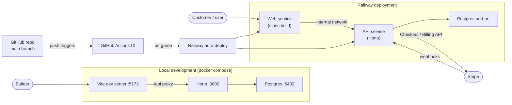

# Vibe Starter — Project Design

> An opinionated, full-stack, agent-friendly starter template for side projects. Designed to let a solo (or tiny-team) non-engineer ship a maintainable, modern app — carried by an AI coding agent operating inside strong guardrails.

This document captures the **project-level** decisions: audience, scope, philosophy, distribution, versioning, and the "Ready for real users?" checklist a builder runs before launching to real customers. For stack-specific decisions, see:

- [`FRONTEND_DESIGN.md`](./FRONTEND_DESIGN.md) — Vite, React, Tailwind CSS, shadcn/ui
- [`BACKEND_DESIGN.md`](./BACKEND_DESIGN.md) — Hono, PostgreSQL, Drizzle, magic-link auth, Stripe, observability
- [`TOOLING_DESIGN.md`](./TOOLING_DESIGN.md) — TypeScript, ESLint, testing, CI/CD, agent context

---

## Decision summary

| Area             | Decision                                                                    | Defended in |
| ---------------- | --------------------------------------------------------------------------- | ----------- |
| Audience         | A solo (or tiny-team) non-engineer building a side project with an AI agent | This doc    |
| Scope            | Full-stack (frontend + backend + database + payments)                       | This doc    |
| Tenancy          | Single-tenant by default; multi-tenancy is a documented escape hatch        | This doc    |
| Distribution     | GitHub template repository                                                  | This doc    |
| Repo name        | `vibe-starter`                                                              | This doc    |
| License          | MIT (`LICENSE` ships in the repo)                                           | This doc    |
| Versioning       | SemVer starting at `1.0.0`                                                  | This doc    |
| Changelog        | Keep-a-Changelog format, automated via `release-please`                     | This doc    |
| Launch readiness | "Ready for real users?" self-review checklist                               | This doc    |
| Future variants  | Lightweight forks acknowledged but deferred                                 | This doc    |

---

## Audience

Vibe Starter is built for **a solo (or tiny-team) non-engineer building a side project or small business with an AI coding agent** (Claude Code, Cursor, Roo Code, etc.) — and for the developers (like the repo owner) who set it up for such people.

The starter is general-purpose. A representative example used throughout these docs is **a small business where customers sign up and pay for something — class sign-ups, appointment bookings, a paid community.** It's just one shape among many, but it's a useful running example because it exercises the parts that matter: self-signup, access control over user-owned data, and real payments.

The builder cannot reliably debug a stack trace and may have no engineering review. They are **carried by their AI agent operating inside the starter's guardrails**: strict types, a baked-in access-control model, opinionated defaults, and a context file the agent reads on day one. The starter's job is to make the correct, maintainable path the path of least resistance — so that what gets shipped is something real users could trust with their data and their money.

### Why one opinionated starter, not a pile of options?

Every choice the starter leaves open is a choice the agent makes on the fly, and the variance across those choices is the source of "AI slop." A non-engineer can't tell a good improvised decision from a bad one. So we make the high-stakes choices **upfront, in writing** — stack, auth model, access-control contract, payments shape — and let the agent inherit them. The result is output that is modern, maintainable, and plausibly real: an app a real customer could use and a real developer could later pick up.

### What if the starter proves too heavy?

We can fork later. `vibe-starter` is the maximalist version; if a lighter variant is needed (e.g., a static-only version for a pure marketing page with no backend), it can be derived. We're explicitly **not** pre-building that fork — it's premature, and we don't yet know which simplifications are actually needed.

---

## Scope

### In scope

- **Frontend:** A Vite + React + TypeScript SPA styled with **Tailwind CSS v4 + shadcn/ui** and design tokens as CSS variables. Mobile-responsive (customers are often on phones). (See `FRONTEND_DESIGN.md`.)
- **Backend:** A Hono API server with PostgreSQL persistence, **single-tenant magic-link authentication** with open self-signup, and an access-control model (`admin`/`user` roles + an ownership rule) baked in as a primitive. (See `BACKEND_DESIGN.md`.)
- **Payments:** **Stripe** (Stripe-hosted Checkout by default; Billing for subscriptions), with webhooks as the source of truth for payment status. (See `BACKEND_DESIGN.md`.)
- **Local development:** `docker compose up` brings up Postgres; the dev server runs frontend + backend concurrently.
- **Deployment:** Railway as the deploy target, with PR preview environments.
- **Quality tooling:** Strict TypeScript, lint-clean enforcement, Vitest with TDD, and pre-commit hooks. (See `TOOLING_DESIGN.md`.)
- **Agent context:** `AGENTS.md` (canonical) plus an `auth` skill shipped upfront, alongside the full bundled skills pipeline pre-installed — workflow `grill-with-docs` → `write-a-prd` → `prd-to-plan` → `run-plan`, with `tdd` and `commit` invoked automatically by the orchestrating skills.

### Explicitly out of scope

| Excluded                                                   | Reason                                                                                                                                                                                                                                       |
| ---------------------------------------------------------- | -------------------------------------------------------------------------------------------------------------------------------------------------------------------------------------------------------------------------------------------- |
| Multi-tenancy (one business serving many other businesses) | This is a single-tenant app (one business, many user accounts). A true multi-tenant SaaS is out of scope by default; the escape hatch (add a `tenantId` FK and scope every query by it) is documented so you can add it if you ever need it. |
| Internationalization (i18n)                                | Most side projects ship in one language. Adding `react-i18next` later is mechanical. Pre-paying the `t('key')` tax across the whole app is a poor trade. Documented upgrade path provided.                                                   |
| PWA / offline support                                      | Mobile-responsive is required (Tailwind handles it); an installable PWA is out of scope.                                                                                                                                                     |
| End-to-end tests (Playwright, Cypress)                     | Component tests via React Testing Library + integration tests via in-process Hono cover the high-value cases. E2E is too much rope for this audience.                                                                                        |
| Storybook / component documentation tooling                | Overkill at side-project scale.                                                                                                                                                                                                              |
| Frontend telemetry / RUM                                   | Nothing shipped by default. Can be added later as a single `<script>` tag if needed.                                                                                                                                                         |
| External secret management (Doppler, Vault, etc.)          | Out of scope; `.env` + Railway env vars cover the use case. Documented pointer if you ever need more.                                                                                                                                        |

---

## Philosophy

Five principles that shape every other decision in this design:

**1. Opinionated defaults beat configurability.**
Every choice the starter doesn't make becomes a choice an agent makes. Agents trained on diverse codebases will pick _plausible_ answers, but the variance across projects is the source of "AI slop." We make the choices upfront, in writing, so the agent inherits them.

**2. Modern, maintainable output — not throwaway slop.**
The goal is an app that _could_ be promoted to a real product: used by real customers, and later picked up and maintained by a real developer without an archaeological dig. Choices are justified on their own merits — modern and widely used, strong agent training data, good-looking defaults, no proprietary lock-in — not because they mirror anyone's existing stack. The stack (Vite/React/Tailwind/shadcn on the frontend, Hono/Postgres/Drizzle on the backend) is deliberately Node-first and approachable end to end, because forcing an unfamiliar or fragmented toolchain onto a solo non-engineer would be hostile.

**3. Static analysis carries the load that humans can't.**
Strict TypeScript, zero-warning ESLint, and `noUncheckedIndexedAccess` prevent classes of bugs at compile time. Without these, agents and non-engineers ship type-coerced code that fails at runtime in ways nobody catches before users do.

**4. Access control is a primitive, not an exercise.**
The auth scaffold ships in the starter: magic-link login, `admin`/`user` roles, and an ownership rule so **users see and edit only their own data**, with admin routes gated behind `requireRole('admin')`. A builder should _use_ this scaffold, not invent it. The most likely high-severity failure mode — a customer reads or mutates another customer's order because a query wasn't scoped to the current user, or a `user` reaches an admin-only route — is mitigated by making correct-by-default the path of least resistance.

**5. The agent is a first-class user.**
The starter ships `AGENTS.md` with stack declarations, do/don't lists, and a build-and-verify protocol. Skills are referenced explicitly. The agent's context window is treated as a designed surface — not an afterthought. If an agent has to guess about the project, we have failed to write the docs.

---

## Architecture overview

A single repository, two services, one deploy target, plus Stripe for payments.



**Local:** `docker compose up` starts Postgres; `npm run dev` runs Vite (frontend) and Hono (backend) concurrently. Vite proxies `/api/*` to Hono. Stripe webhooks are forwarded to the local Hono server via the Stripe CLI.

**Production:** GitHub Actions runs CI on every push and PR. Branch protection on `main` requires CI to pass. Railway watches `main` and deploys. PR preview environments spin up automatically. Stripe sends live webhooks to the public Railway URL — payments need a public endpoint, which Railway provides in prod and the Stripe CLI provides in dev.

For a deeper request-flow, auth-flow, and Stripe-webhook view, see `BACKEND_DESIGN.md`.

---

## Distribution

### GitHub template repository

`vibe-starter` is published as a GitHub **template repository** (Settings → Template repository). Builders click "Use this template" → "Create a new repository" and get a fresh, history-clean copy.

**Why a template, not a CLI scaffold:**

A `npx create-vibe-app` CLI sounds nicer but adds maintenance: npm publishing, version pinning, cross-platform shell quirks (Windows vs macOS vs Linux). The "Use this template" button is something every GitHub user already knows. The benefit of a CLI (slightly smoother first-run UX) doesn't justify the cost. Revisit if manual post-clone steps become a friction point in practice.

### Quick Start (5 commands)

The starter README documents this exactly:

```bash
# 1. Create your repo from the template, then:
git clone <your-new-repo-url>
cd <your-repo>

# 2. Configure environment
cp .env.example .env  # then edit .env with real values

# 3. Start Postgres
docker compose up -d

# 4. Install dependencies
npm install

# 5. Start dev server (auto-runs migrations via predev hook)
npm run dev
```

**`predev` auto-runs migrations.** This was a deliberate choice. Migration-not-run is the most common source of cryptic Postgres errors for a new builder, and `predev` removes the failure mode.

A `scripts/bootstrap.sh` is provided for one-time setup (replacing the placeholder project name `vibe-starter` in `package.json`, generating a `SESSION_SECRET`, etc.). The script is idempotent and safe to re-run.

---

## Versioning

### Semantic versioning starting at `1.0.0`

Reasoning: starting at `0.x.y` would imply "not ready for real use," which contradicts the starter's purpose. Builders should pull this and trust it. `1.0.0` says "use this." If we get the design wrong, `2.0.0` is cheap.

### Keep-a-Changelog + release-please automation

`CHANGELOG.md` follows the [Keep a Changelog](https://keepachangelog.com/) format, with sections for `Added`, `Changed`, `Deprecated`, `Removed`, `Fixed`, `Security`.

The CHANGELOG is generated automatically by [`release-please`](https://github.com/googleapis/release-please) from conventional commits on `main`. Every PR that lands triggers a release-please PR that bumps the version and updates the changelog; merging that PR cuts a tagged release. Zero manual changelog maintenance.

This pairs well with the `commit` skill from the pre-installed skills pipeline, which produces conventional-commit messages (invoked automatically by `run-plan` after each phase).

### Template-snapshot semantics

GitHub template repos produce **point-in-time copies**. Existing projects do not auto-update when `vibe-starter` evolves. The CHANGELOG's role is therefore:

> When a builder asks "should I update?", they read the CHANGELOG and decide whether to manually pull changes.

The starter's README includes a one-paragraph note explaining this. Major releases (e.g., `1.x → 2.x`) should include a brief migration note in the changelog entry indicating what an existing project would need to do to upgrade.

---

## Ready for real users?

Before you launch to real customers — especially before you take real payments — run this short self-review. (For the _setup_ that gets you to a live deployment — creating your Railway / Resend / Stripe accounts, verifying a sending domain, wiring the Stripe webhook, connecting a custom domain — follow `DEPLOY.md`; this checklist is the _gate_ you run once that's done.) It's your own pre-launch checklist, not an external review. If anything below is unchecked, you're not ready yet. (The canonical copy to tick through lives in `DEPLOY.md` under "Ready for real users?" — there is intentionally no separate `LAUNCH_CHECKLIST.md`.)

**Access control is intact.**

- Admin-only routes are gated with `requireRole('admin')`.
- Users can only see and edit their own rows — queries for user-owned data filter by the current user (no IDOR; a customer can never reach another customer's order).
- The access-control anchor test passes. (See `BACKEND_DESIGN.md`.)

**Secrets are safe.**

- Every secret lives in an environment variable, never in code. `gitleaks` reports clean.
- `.env` is not committed (it's gitignored).

**Stripe is production-ready.**

- Switched from test-mode to **live-mode** keys.
- The webhook signature is verified against the raw request body, and you've tested the full flow end-to-end with a real card.
- Payment status comes from the webhook, never from the client redirect.

**The database is protected.**

- Backups are enabled (Railway Postgres backup add-on) and you know how to restore from one.

**Production config is correct.**

- All required env vars are set in the Railway production environment.
- The app fails loudly on startup if anything is missing or malformed (zod env validation).

**You can see what's happening.**

- The root error boundary works (the app shows a friendly error, not a white screen).
- Structured logging is on and you know how to find errors in the Railway logs.

**It works on a phone.**

- A quick pass on a real phone or device emulator — customers will mostly be on mobile.

**Legal & safety basics.**

- A privacy policy and terms of service are published.
- **If your app handles children's or other sensitive personal data:** get the appropriate consent (e.g., **parental consent** before collecting anything about a child) and collect the **minimum** data you actually need, deleting what you don't.

> The children's-data note above is a COPPA-style "minimize and get parental consent" guideline, not legal advice. Handling children's or other sensitive personal data carries real legal obligations that vary by jurisdiction — if you're unsure, consult a professional before launch.

---

## Open considerations

Items deliberately deferred but worth flagging:

- **First-feature tutorial content.** A concrete end-to-end walkthrough — building a **contact form** (a public `POST /api/contact` that validates with zod, mounts the shipped `rateLimit()` middleware plus a hidden honeypot, and emails a configured `CONTACT_EMAIL` via the Resend wrapper; optionally persisting submissions to a `contact_messages` table) — is on the pre-launch list. It's a deliberately strong first feature: nearly every project wants one, and it composes four shipped primitives (Resend, the rate limiter, zod, shadcn `Form`) while teaching the public-endpoint abuse-protection pattern. It must be written and tested end-to-end with a real agent before public release.
- **Versioning strategy for downstream projects.** `vibe-starter` versions itself, but there's no mechanism for an existing project to know which template version it started from. Acceptable for now (template-snapshot semantics, documented), but worth revisiting if cross-project maintenance becomes a real burden.
- **Sales tax on payments.** Stripe Checkout handles the charge, but tax remittance is on you. When this becomes burdensome, revisit Stripe Tax or a merchant-of-record alternative (Lemon Squeezy / Paddle). See `BACKEND_DESIGN.md`.
