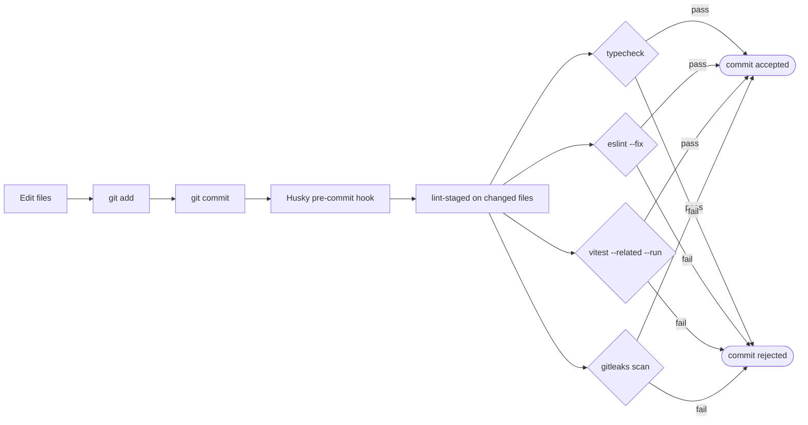
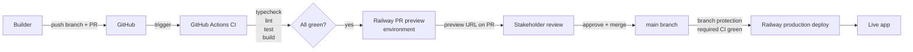
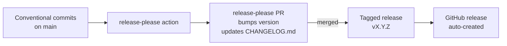

# Vibe Starter — Tooling Design

> Strict TypeScript, zero-warning ESLint, Vitest with TDD, pre-commit gates, GitHub Actions CI, Railway deploy with PR previews. The agent is treated as a first-class user — `AGENTS.md` is the canonical context, the bundled skills pipeline is the recommended orchestration.

This document covers static analysis, testing, CI/CD, repo bootstrap, and agent context. For project-level decisions, see [`PROJECT_DESIGN.md`](./PROJECT_DESIGN.md). For frontend, see [`FRONTEND_DESIGN.md`](./FRONTEND_DESIGN.md). For backend, see [`BACKEND_DESIGN.md`](./BACKEND_DESIGN.md).

---

## Decision summary

| Decision               | Choice                                                                                                                                                                                                                                          | Primary alternative considered                            |
| ---------------------- | ----------------------------------------------------------------------------------------------------------------------------------------------------------------------------------------------------------------------------------------------- | --------------------------------------------------------- |
| TypeScript strictness  | **`strict` + `noUncheckedIndexedAccess`**                                                                                                                                                                                                       | Loose, "maximum strict" with `exactOptionalPropertyTypes` |
| `any` policy           | **Banned as ESLint error**                                                                                                                                                                                                                      | Allowed with warning, allowed silently                    |
| Type-error suppression | **`@ts-expect-error` allowed; `@ts-ignore` forbidden**                                                                                                                                                                                          | Both allowed                                              |
| ESLint preset          | **`@typescript-eslint/recommended-type-checked` + `eslint:recommended`**                                                                                                                                                                        | `eslint:recommended` only                                 |
| Warning policy         | **Zero warnings** (every rule `error` or `off`)                                                                                                                                                                                                 | Warnings allowed                                          |
| Formatter              | **Prettier**, 100-char line limit                                                                                                                                                                                                               | dprint, ESLint stylistic                                  |
| Test runner            | **Vitest**                                                                                                                                                                                                                                      | Jest                                                      |
| Component testing      | **React Testing Library + MSW**                                                                                                                                                                                                                 | Enzyme, Cypress component tests                           |
| Backend testing        | **In-process Hono + test DB**                                                                                                                                                                                                                   | Supertest with mocks                                      |
| TDD methodology        | **Yes — `tdd` skill from the bundled skills pipeline (pre-installed)**                                                                                                                                                                          | Tests written after implementation                        |
| Coverage threshold     | **None**                                                                                                                                                                                                                                        | 80% line coverage                                         |
| Pre-commit             | **Husky + lint-staged + gitleaks**                                                                                                                                                                                                              | Pre-commit hooks omitted                                  |
| Pre-commit tests       | **`vitest --related --run`**                                                                                                                                                                                                                    | Full suite, no tests                                      |
| CI                     | **GitHub Actions**                                                                                                                                                                                                                              | Railway built-in CI, CircleCI                             |
| Deploy                 | **Railway GitHub integration + branch protection**                                                                                                                                                                                              | CI-orchestrated deploy                                    |
| PR previews            | **Enabled**                                                                                                                                                                                                                                     | Disabled                                                  |
| Agent context          | **`AGENTS.md` canonical + `CLAUDE.md` symlink**                                                                                                                                                                                                 | Tool-specific files maintained separately                 |
| Skill orchestration    | **Bundled skills pipeline pre-installed** ([`semi-sentient/skills-workflow`](https://github.com/semi-sentient/skills-workflow)) — workflow: `grill-with-docs` → `write-a-prd` → `prd-to-plan` → `run-plan` (`tdd` + `commit` run automatically) | None / leave to user                                      |
| Distribution           | **GitHub template repo**                                                                                                                                                                                                                        | npm scaffold CLI                                          |
| Node version           | **24.x**, pinned via `.nvmrc` and `engines`                                                                                                                                                                                                     | LTS without pinning                                       |
| Package manager        | **npm**                                                                                                                                                                                                                                         | pnpm, yarn                                                |
| License                | **MIT**                                                                                                                                                                                                                                         | Proprietary                                               |

---

## TypeScript strictness

### Decision

```jsonc
// tsconfig.json (key compiler options)
{
	"compilerOptions": {
		"strict": true,
		"noUncheckedIndexedAccess": true,
		"noFallthroughCasesInSwitch": true,
		// The following are deliberately NOT enabled:
		// - "exactOptionalPropertyTypes": adds friction for marginal benefit
		// - "noImplicitOverride": ceremony without significant payoff
	},
}
```

Plus an ESLint rule banning `any`:

```jsonc
// eslintrc, key rules
{
	"rules": {
		"@typescript-eslint/no-explicit-any": "error",
		"@typescript-eslint/ban-ts-comment": [
			"error",
			{
				"ts-ignore": true, // forbidden
				"ts-expect-error": false, // allowed
			},
		],
	},
}
```

### Why

**`strict: true`** is the modern default and catches the most common bug class (null/undefined access). The agent handles it fluently. There's no reason to disable.

**`noUncheckedIndexedAccess`** is the highest-ROI addition. It makes `array[i]` return `T | undefined` instead of `T`, matching the runtime truth. A vibe coder writing `users[0].name` without checking gets a compile error instead of a 2am production crash. The agent handles this by adding type guards or non-null assertions when contextually safe.

**Banning `any`** is the slop-prevention lever. The agent's escape valve when types get hard is to cast to `any`. If `any` is a hard error, the agent must actually solve the type problem — which usually means writing better code (proper type guards, narrowing with `unknown`, defining the right interface). This is the single setting that most reduces "AI slop."

**`@ts-expect-error` over `@ts-ignore`.** Both suppress type errors. The first requires a suppressed error to _actually exist_ — so when the underlying code is fixed, `@ts-expect-error` self-clears (it becomes an error itself if there's nothing to expect). `@ts-ignore` silences indefinitely; suppressed errors accumulate and rot.

### Alternatives considered

**Loose / `strict: false`.** Lets the agent move fast at the cost of letting bugs through. Rejected on the philosophy that static analysis carries the load humans can't.

**Maximum strict** (adding `exactOptionalPropertyTypes`, `noImplicitOverride`, etc.). The marginal bug-prevention is real but small; the friction is significant. Agents loop more often on these and sometimes give up. Rejected as a poor trade for prototype-grade work.

### Trade-offs

The agent occasionally gets stuck on a typing problem and burns iterations. Mitigation: AGENTS.md gives explicit guidance — "use type guards, prefer `unknown` over `any`, narrow before access." With this context, the agent's success rate stays high.

---

## ESLint, Prettier, formatting

### Decision

**ESLint** with `@typescript-eslint/recommended-type-checked` + `eslint:recommended`. **Prettier** for formatting. Zero warnings — every rule is `error` or `off`.

### Why

**Type-checked rules** (the `recommended-type-checked` variant) require type information and catch a class of bugs the simpler `recommended` variant misses:

- `no-floating-promises` — forgotten `await`s
- `no-misused-promises` — a `Promise` used as a boolean
- `no-unnecessary-condition` — checking a value that's typed as always truthy
- `no-unsafe-assignment` / `-call` / `-member-access` — trying to use `any` where a real type was expected

These rules genuinely prevent slop. The lint runs slower (~5-15 seconds vs. ~1 second for non-type-checked), but for prototype-scale repos this is fine.

**Zero warnings.** Warnings get ignored, accumulate, and become noise. Three months in, a 400-warning project has trained everyone (including the agent) to ignore them. Forcing every rule to be `error` or `off` keeps lint output meaningful — green means green.

**Prettier separately for formatting.** The standard split: ESLint stops at code style; Prettier handles whitespace, quotes, semicolons, line breaks. `eslint-config-prettier` disables ESLint's stylistic rules to avoid conflicts. 100-char line limit (slight bump over Prettier's default 80, fewer awkward JSX wraps).

### Specific rules toggled on top of presets

| Rule                                         | Setting                                            | Why                                                                                                      |
| -------------------------------------------- | -------------------------------------------------- | -------------------------------------------------------------------------------------------------------- |
| `import/order`                               | `error`, alphabetized within groups                | Sorted imports help the agent and keep diffs clean                                                       |
| `react-hooks/exhaustive-deps`                | `error` (not warn)                                 | Catches real bugs in effect dependencies                                                                 |
| `react/jsx-key`                              | `error`                                            | Missing keys cause real React reconciliation bugs                                                        |
| `no-console`                                 | `error`, except `console.warn` and `console.error` | Forces intentional logging via the logger                                                                |
| `@typescript-eslint/consistent-type-imports` | `error`                                            | Separates type-only imports for tree-shaking and clarity                                                 |
| `tailwindcss/no-arbitrary-value`             | `error`                                            | Discourages `bg-[#f00]` / `text-[13px]` so the design system stays consistent (see `FRONTEND_DESIGN.md`) |

### Alternatives considered

**`eslint:recommended` only.** Simpler, faster lint. Rejected because it misses the type-aware rules that prevent the highest-impact bugs.

**Biome / dprint.** Rust-based alternatives that combine lint + format. Faster, but smaller rule set, smaller community, less mature TypeScript support. Revisit in 12 months.

**ESLint flat config** (`eslint.config.js`). Adopted — it's the modern standard. Old `.eslintrc.json` is legacy.

---

## Testing

### Decision

**Vitest** as the runner. **React Testing Library + MSW** for component tests. **In-process Hono + test database** for backend tests. **TDD via the `tdd` skill** (pre-installed from the bundled skills pipeline). **No coverage threshold.** Tests **colocated** with source.

### Why this shape

The default "Vitest + RTL + 80% coverage" advice produces test slop in vibe-coded contexts. We deliberately reject coverage thresholds, E2E tests, and most UI tests to prevent the failure modes:

1. **Tests written for coverage** become tautological — `expect(getUser(1)).toEqual(getUser(1))`. Coverage gates produce these.
2. **UI tests for prototype-grade UIs** are expensive to maintain and rarely catch real bugs (the bugs they catch are visible on the screen anyway).
3. **E2E tests** are too much rope — flaky, slow, and require non-engineers to debug Playwright.

The bugs that actually ship in vibe-coded apps:

| Bug class                                                                   | Severity    | How we catch it                                     |
| --------------------------------------------------------------------------- | ----------- | --------------------------------------------------- |
| Access-control bugs (a user reaching another user's data or an admin route) | High        | Backend integration tests against the auth scaffold |
| Data integrity (lost updates, broken migrations)                            | Medium-high | Backend integration tests; Drizzle migration tests  |
| Type-correct-but-semantically-wrong logic                                   | Medium      | Targeted unit tests via TDD                         |
| UI rendering crashes                                                        | Lower       | Error boundary catches; tests skipped               |

TDD inverts the test-slop dynamic. Tests written _before_ implementation drive the design — they describe the behavior the developer wants. When you can't write the test, the design is wrong; refactor instead of skipping the test. The `tdd` skill (pre-installed from the bundled skills pipeline) codifies the red-green-refactor methodology, is referenced by AGENTS.md for ad-hoc work, and is read automatically by `write-a-prd` and `run-plan` when the full pipeline is used.

### Concrete patterns

**Backend integration tests** use the `createTestServer()` helper that wraps Hono's `app.request()` — no HTTP, no mocking:

```typescript
import { createTestServer } from './helpers';
import { resetDb } from './helpers';

describe('GET /api/orders', () => {
	beforeEach(resetDb);

	it('returns only the orders owned by the requesting customer', async () => {
		const customerA = await createUser({ email: 'a@example.com', role: 'user' });
		const customerB = await createUser({ email: 'b@example.com', role: 'user' });
		await createOrder({ userId: customerA.id, description: 'Intro session' });
		await createOrder({ userId: customerB.id, description: 'Follow-up session' });

		const server = createTestServer();
		const res = await server.request('/api/orders', {
			headers: { Cookie: await loginAs({ userId: customerA.id, role: 'user' }) },
		});

		expect(res.status).toBe(200);
		const body = await res.json();
		expect(body.orders).toHaveLength(1);
		expect(body.orders[0].description).toBe('Intro session');
	});
});
```

This test exercises the real Hono router, real auth middleware, real Drizzle queries, real Postgres — but in-process and fast (no HTTP overhead). Access-control bugs — a customer seeing another customer's order — are nearly impossible to write without the test catching them. This is the access-control anchor test the "Ready for real users?" checklist refers to (see `PROJECT_DESIGN.md`).

**Component tests** use MSW to mock API responses:

```typescript
import { render, screen } from '@testing-library/react';
import { server } from './msw-server';
import { http, HttpResponse } from 'msw';
import { OrdersList } from '../src/web/components/OrdersList';

it('shows the orders returned by the API', async () => {
  server.use(
    http.get('/api/orders', () => HttpResponse.json({
      orders: [{ id: 1, description: 'Intro session', status: 'paid' }],
    }))
  );

  render(<OrdersList />);
  expect(await screen.findByText('Intro session')).toBeInTheDocument();
});
```

MSW intercepts at the network layer; the same handlers can power offline development if needed.

### Conventions in `AGENTS.md`

- Write tests for: (a) any new access-control rule, (b) any business logic that doesn't reduce to type-checking, (c) any bug you've fixed (regression test).
- Do NOT write tests for: (a) UI rendering, (b) trivial getters/setters, (c) anything to satisfy a coverage threshold.
- Co-locate route/component tests with their source by default (`Button.tsx` + `Button.test.tsx`), but keep a `src/server/__tests__/` tree for cross-cutting invariants (access-control, full auth flow).
- For any new feature, read `tdd` skill and follow red-green-refactor.

### Alternatives considered

**Jest.** Industry standard. Rejected because Vitest is faster (native ESM, no Babel), uses Vite's resolver (so test imports match dev/prod imports), and has identical API. No reason to keep Jest.

**Cypress component tests.** Rejected — heavyweight for what they buy.

**Playwright E2E.** Documented out of scope (see `PROJECT_DESIGN.md`).

**80% coverage threshold.** Rejected as a slop-producer. TDD produces meaningful coverage as a byproduct.

---

## Pre-commit hooks

### Decision

**Husky + lint-staged + gitleaks** for pre-commit. Runs typecheck, lint, related-tests, and secret-scanning on staged files.

### Why

CI catches what slips through local checks, but a CI-only feedback loop is slow — the agent commits broken code, the human pushes, CI fails, friction. Pre-commit gates surface failures at commit time.



**`vitest --related --run`** runs only tests in the dependency graph of the staged files. Fast (seconds, not minutes), agent-friendly. Won't punish the developer for unrelated flakes.

**gitleaks** scans staged content for committed secrets — API keys, tokens, password-like strings. Catches the worst-case "I committed my `STRIPE_SECRET_KEY`" failure before it leaves the machine.

### Asymmetry: pre-commit vs CI

Pre-commit must be fast enough that the agent doesn't get stuck waiting. CI is the safety net.

| Check     | Pre-commit        | CI               |
| --------- | ----------------- | ---------------- |
| Typecheck | Staged-file scope | Full project     |
| Lint      | Staged-file scope | Full project     |
| Tests     | `--related`       | Full suite       |
| gitleaks  | Staged content    | Full git history |
| Build     | —                 | Yes              |

### Alternatives considered

**No pre-commit hooks.** Standard for teams that trust CI. Rejected for the vibe-coder context — the friction of "discover failure on CI 2 minutes after commit" is meaningfully worse than "discover failure at commit time."

**Full test suite on pre-commit.** Slower; gets unbearable as the project grows. The `--related` heuristic is the right balance.

---

## CI/CD

### Decision

**GitHub Actions** for CI. **Single workflow** on PR + push to `main`. **Railway's GitHub integration** for deploy, gated by **branch protection** on `main`. **PR preview environments** enabled by default.

### Why



**GitHub Actions** is the obvious choice — same auth as the repo, free at our scale, near-universal training data. It works with whatever repo collaborators the project has, with no special org setup required.

**Single workflow** because prototype-scale repos don't have enough surface area to justify split workflows. ~50 lines of YAML running typecheck + lint + test + build in parallel jobs.

**Railway's GitHub integration** auto-deploys on push to `main`. Combined with branch protection requiring CI to pass, `main` only ever receives green commits — Railway's auto-deploy is safe. No deploy tokens for the builder to manage. Railway also gives the app a public URL, which Stripe webhooks need in production (in dev, the Stripe CLI forwards events — see `BACKEND_DESIGN.md`).

**Branch protection** for repos that have multiple contributors: require PR before merge, require CI to pass, require ≥1 review. **For solo prototypes, branch protection can be disabled** — the starter docs explain when to enable it.

**PR preview environments** (Railway feature) spin up an ephemeral deployment per PR. Stakeholders get a clickable link to see the WIP without anyone running it locally. Particularly valuable for a non-engineer builder demoing to a friend or early user.

### Alternatives considered

**CI-orchestrated deploy** (run Railway CLI from Actions). More control, more complexity, more credentials to manage. Rejected — the GitHub integration is simpler and equally safe given branch protection.

**Railway's built-in CI.** Deploy-only, doesn't run tests. Not a substitute for GitHub Actions.

**CircleCI / Travis / Jenkins.** No reason to introduce a third party when Actions handles it.

---

## Repo bootstrap

### Decision

**GitHub template repo** distribution. **4-command Quick Start** (clone, `npm run setup`, `docker compose up`, `npm run dev`). **`npm run setup`** (`npm install && bash scripts/bootstrap.sh`) is the single entry point that installs dependencies and bootstraps the new repo. **`predev` script** auto-runs migrations before dev server starts.

See `PROJECT_DESIGN.md` for the distribution decision rationale (template vs CLI).

### What the bootstrap step does

`npm run setup` runs `npm install` and then `bash scripts/bootstrap.sh`. The bootstrap script is idempotent and safe to re-run; it:

1. **Copies `.env` from `.env.example`** if `.env` is absent.
2. **Resolves a project name** — an explicit argument wins (`npm run setup -- my-app`), then an interactive prompt (`Project name [<dir>]:`, where an empty answer accepts the default), falling back to the repo directory name when running non-interactively.
3. **Resets release state** by calling `node scripts/reset-release-state.mjs "$NAME" "$ORIGIN"` (see [Versioning automation](#versioning-automation)). The node module — not `sed` — owns the rewrite: it sets the release-please manifest to `0.0.0`, renames `package.json` (name + version → `0.0.0`), adds `initial-version: "0.1.0"` / `include-component-in-tag: false` / `package-name` to the release-please config, resets `CHANGELOG.md` to a header + intro stub, and rewrites the `README.md` H1 from `# vibe-starter` to the project name (the H1 only — other `vibe-starter` references, like the upstream CHANGELOG link, intentionally keep pointing at the template). Each rewrite is guarded, so the module **no-ops** on the upstream `semi-sentient/vibe-starter` origin, the `vibe-starter` name, or an already-renamed package — which is what keeps this template repo itself on its own version line.
4. **Generates a `SESSION_SECRET`** in `.env` if one isn't set.

Splitting the rewrite into a node module (rather than inline `sed`) keeps the JSON edits structured and the idempotency guards readable, and lets the bootstrap shell stay a thin orchestrator.

### README structure

The starter ships a README with 7 core sections plus a pre-launch tutorial section:

1. **What this is** — one paragraph
2. **Quick Start** — 4 commands
3. **Stack** — bullet list with one-line description per piece
4. **Project structure** — annotated tree
5. **Development workflow** — pre-commit hooks, TDD, AGENTS.md role
6. **Deploy** — short overview that points to `DEPLOY.md` (the full go-live runbook: external accounts + first deploy)
7. **Skills** — list of the pre-installed skills and the recommended `grill-with-docs` → `write-a-prd` → `prd-to-plan` → `run-plan` workflow
8. _(Pre-launch only)_ **First-feature tutorial** — a contact-form walkthrough (public endpoint → zod validation → `rateLimit()` + honeypot → email via the Resend wrapper); tracked in `TODO.md`

---

## Agent context

### Decision

**`AGENTS.md` is canonical** for agent context. **`CLAUDE.md` is a symlink** for Claude Code. Tool-specific files (`.cursorrules`, `.windsurfrules`, etc.) are not duplicated — `AGENTS.md` is the source of truth.

**The `auth` skill** ships pre-installed (the only skill authored specifically for this starter and shipped upfront). Other skills accumulate reactively as patterns recur.

**The bundled skills pipeline** ([`semi-sentient/skills-workflow`](https://github.com/semi-sentient/skills-workflow)) ships pre-installed. The full pipeline is bundled — `grill-with-docs`, `grill-me`, `write-a-prd`, `prd-to-plan`, `run-plan`, plus the supporting `tdd` and `commit` — so the builder makes zero decisions about which skills to install. The ideal workflow is `grill-with-docs` → `write-a-prd` → `prd-to-plan` → `run-plan`; `tdd` and `commit` are invoked automatically by the orchestrating skills and never directly. New users can shortcut by invoking `write-a-prd` first — it auto-invokes `grill-with-docs` if no grilling session has run.

**One MCP server ships pre-registered:** `context7` (`@upstash/context7-mcp`, in `.mcp.json`), a docs-lookup fallback for installed libraries without dedicated tooling. Usage guidance — including the version-drift caveat — lives in `docs/agents/mcp-usage.md`.

### Why one canonical file

Agent rule files have proliferated: `CLAUDE.md` (Claude Code), `.cursorrules` (Cursor), `.cursor/rules/*.mdc` (newer Cursor), `.roo/rules/*.md` (Roo Code), `.windsurfrules`, `.github/copilot-instructions.md`, and the emerging `AGENTS.md` convention.

Maintaining six near-duplicate files invites drift. `AGENTS.md` is increasingly read by major agents and is the cleanest cross-tool target. A symlink (`CLAUDE.md → AGENTS.md`) handles Claude Code without duplication.

### What goes in `AGENTS.md`

Apply one filter, borrowed from Addy Osmani's [AGENTS.md as a protocol file](https://addyosmani.com/blog/agents-md/): **can the agent discover this by reading the code?** If yes, leave it out. `AGENTS.md` is a protocol file — the minimum essential context the agent genuinely cannot derive from the repo itself. Stack declarations, directory tours, library do/don't lists, and architecture overviews belong in `/docs` (this design doc and its siblings) and `CONTEXT.md` (maintained by `grill-with-docs`), where they are loaded deliberately rather than re-read every turn. Task-scoped conventions sit one layer below that: `AGENTS.md` carries a "Topic Documentation" routing table that points the agent at `docs/agents/{documentation,mcp-usage,react-patterns,testing,ui-components}.md` — short, on-demand topic docs read only when the task matches the row, so the protocol file stays lean.

The starter ships `AGENTS.md` with five short sections, each earning its place against the filter. `CLAUDE.md` is a symlink to `AGENTS.md` so Claude Code picks up the same content.

**1. Non-Negotiables.** Collaboration rules the agent cannot infer from code: surface assumptions, stop on conflicts, push back when you disagree, prefer the boring solution, touch only what was asked. About _how_ the agent behaves, not _what_ the codebase looks like.

**2. Quality Expectations.** One short paragraph setting tone ("this codebase will outlive you — fight entropy"). Deliberately brief; tone-setting has diminishing returns and the article's caution about "general style guides" applies past a paragraph.

**3. Coding Standards.** Conventions a fresh agent would otherwise guess at: no barrel exports, alphabetical sorting (imports/exports/object keys/destructured props), file-naming case rules, `interface` over `type`, `as const` over `enum`, and a numbered priority order for when guidelines conflict. These anchor patterns from day one of a near-empty repo — once the codebase has examples, the agent could derive most, but the explicit rules keep the first commits from drifting.

**4. Plan Mode.** Where plans live (`.agents/plans/{kebab-name}.md`), when to run `grill-with-docs` first, and the requirement to read the `tdd` skill before adding new behavior. Pure process — invisible in the code.

**5. Temporary Artifacts.** Scratch files go in `.agents/scratch/`, not `/tmp/`. A convention the agent would otherwise default away from; the `.gitignore` entry alone doesn't communicate the intent.

### What deliberately stays out

The article warns hardest against the "context dump" pattern. The starter omits, by design:

- **Stack declaration.** `package.json` is authoritative; `npm ls` is faster than re-reading a list that goes stale. Stack rationale lives in this doc and the sibling design docs.
- **Library do/don't lists.** "Use shadcn's `Table`, not TanStack Table until you need it" / "Tailwind tokens over arbitrary values" / "Drizzle, not raw `pg`" are discoverable from the dependency tree and existing usage. Surfacing them as rules competes with rules that _aren't_ discoverable. Library-specific patterns live in skills (`shadcn-patterns`, `tailwind`, `stripe`, `drizzle-postgres`) — created reactively as failure modes appear, not speculatively upfront.
- **Build-and-verify command list.** `package.json` scripts are the source of truth. The `tdd` and `run-plan` skills already brief the agent on the verify gate; AGENTS.md should not duplicate the commands.
- **Directory tours and architecture overviews.** `/docs/*_DESIGN.md` and `CONTEXT.md` handle this, loaded on demand.
- **Skill catalog as freeform prose.** Claude Code surfaces skill descriptions automatically when triggered. The README documents the recommended `grill-with-docs` → `write-a-prd` → `prd-to-plan` → `run-plan` workflow for humans; AGENTS.md does not need to restate it.

### Slop-attractor guidance

Anti-patterns like "don't add dependencies casually," "don't introduce a new state library," "don't disable ESLint rules," "don't reinvent the auth scaffold" are real, but they fit better in two places than in a top-level do/don't list:

- The general posture ("prefer the boring solution," "touch only what you're asked") is already in **Non-Negotiables**.
- The specific anti-patterns belong in the skill that owns the affected area — access-control warnings in the `auth` skill, styling warnings in a future `tailwind` skill, dependency-hygiene guidance in a project ADR.

This keeps the root file short enough that the agent actually reads it, while pushing detail to layers that load only when relevant.

### Why ship the `auth` skill upfront, but no other skills?

Most prototype-specific skills (`shadcn-patterns`, `tailwind`, `stripe`, `drizzle-postgres`, `hono-api`) earn their place only after we've seen the failure mode they prevent. Writing them upfront is speculative work.

The exception — and the only skill shipped upfront — is the `auth` skill, because:

1. The starter ships auth and access control as primitives. The agent needs the contract on day one.
2. The cost of getting access control wrong is the highest of any skill on the list (a user reading or mutating another user's data, or a `user` reaching an `admin`-only route).
3. We can write it once, drawing directly from how the starter implements auth — it's documenting code that exists, not synthesizing patterns.

The `auth` skill documents: how to add a protected route (`requireRole`), the role model (`admin`/`user`), the ownership rule (every query for user-owned rows filters by `userId = c.var.user.id` unless the caller is `admin`), and the optional multi-tenant escape hatch (add a `tenantId` FK and scope by it only if you ever build a true multi-tenant SaaS — see `BACKEND_DESIGN.md`). Other skills are added as the same correction recurs across multiple prototypes.

### Bundled skills pipeline integration

The starter ships with the full pipeline pre-installed. The builder doesn't pick skills — the point of the starter is to remove that decision so a vibe coder can produce good code without curating their own agent toolbox.

Pre-installed skills:

| Skill             | Role                                                                                                                                                                                                                               |
| ----------------- | ---------------------------------------------------------------------------------------------------------------------------------------------------------------------------------------------------------------------------------- |
| `grill-with-docs` | Stress-tests an idea against the existing domain model, sharpening terminology and updating `CONTEXT.md` / ADRs inline. Entry point for non-trivial features.                                                                      |
| `grill-me`        | Adversarial grilling of a plan/design without the doc-update step; the lighter sibling of `grill-with-docs`.                                                                                                                       |
| `write-a-prd`     | Captures the resolved design as a PRD. Auto-invokes `grill-with-docs` if no grilling session has run, so it's also a valid entry point for users who want a simpler flow.                                                          |
| `prd-to-plan`     | Breaks the PRD into tracer-bullet phases with confidence-scored acceptance criteria.                                                                                                                                               |
| `run-plan`        | Executes the plan in a fresh conversation by delegating phases to specialized sub-agents.                                                                                                                                          |
| `tdd`             | Red-green-refactor methodology. Never invoked directly — read by `write-a-prd` while authoring; every Code sub-agent spawned by `run-plan` is briefed to apply it; referenced by `AGENTS.md` for ad-hoc work outside the pipeline. |
| `commit`          | Produces a Conventional Commits message from staged changes. Invoked automatically by `run-plan` after each phase; this feeds the `release-please` automation that maintains `CHANGELOG.md`.                                       |

The ideal workflow is `grill-with-docs` → `write-a-prd` → `prd-to-plan` → `run-plan`, with steps 1–3 in one conversation and step 4 in a fresh one. See [`semi-sentient/skills-workflow` docs/WORKFLOW.md](https://github.com/semi-sentient/skills-workflow/blob/main/docs/WORKFLOW.md) for the full walkthrough.

The bundled set is pinned in `skills-lock.json` and managed with the `skills` CLI: `npx skills experimental_install` restores the locked set into a fresh clone, and `npx skills update` moves them to the latest upstream versions when a new version of the pipeline lands. The starter's `CHANGELOG.md` notes when bundled skill versions move.

---

## Mundane decisions resolved

A few items resolved without dedicated sections:

- **Node 24** pinned via `.nvmrc` and `engines` field in `package.json`. CI uses the same version. Pinning matters because vibe coders' machines have inconsistent Node installs.
- **npm** as package manager (not pnpm or yarn). Most widely used; least friction for non-engineers; `package-lock.json` committed.
- **License: MIT.** A `LICENSE` file ships in the repo. The starter is published as a public repo, and MIT is the boring, permissive default that lets anyone clone and build on it.
- **Repo name: `vibe-starter`.** Matches the package name; the bootstrap script swaps it for the builder's chosen name.
- **Storybook: not shipped.** Overkill for prototype scale.

---

## Versioning automation

**`release-please`** as a GitHub Action watches conventional commits on `main` and opens a PR that bumps `package.json` version and updates `CHANGELOG.md`. Merging that PR cuts a tagged release.



The CHANGELOG generated by release-please follows [Keep a Changelog](https://keepachangelog.com/) format — `Added`, `Changed`, `Deprecated`, `Removed`, `Fixed`, `Security` sections.

### Downstream reset

A repo generated from this template starts its own version line at `0.1.0`, independent of whatever version the template itself is on. `npm run setup` (via `scripts/reset-release-state.mjs`, see [What the bootstrap step does](#what-the-bootstrap-step-does)) makes this happen by resetting `.release-please-manifest.json` to `0.0.0` and adding `"initial-version": "0.1.0"` (plus `"include-component-in-tag": false`, so tags are a plain `vX.Y.Z` rather than component-prefixed) to `release-please-config.json`. **The expected first downstream release is `0.1.0`.** The upstream template repo is unaffected — its own origin/name/package guards make the reset a no-op there, so it keeps advancing on its existing version line.

Why `0.1.0`: a `0.0.0` manifest is release-please's "never released yet" sentinel. For `release-type: node`, the default first release from that sentinel is `1.0.0` (release-please's base-strategy default, which the node strategy does not override — verified against release-please v17.7.0 source; only the `python`/`rust`/`terraform-module` strategies default to `0.1.0`). So `initial-version: "0.1.0"` ([a real config-schema key](https://github.com/googleapis/release-please/blob/main/schemas/config.json)) is load-bearing: it pins the first release to `0.1.0` instead of letting it jump to `1.0.0`. (release-please's `docs/manifest-releaser.md` claims "0.1.0 for node", but that line is stale and contradicts the code — don't drop `initial-version` on its strength.)

If the first release PR in a generated repo does _not_ come out as `0.1.0` (e.g. it comes out as `1.0.0`), the deterministic fallback is to add a `Release-As: 0.1.0` footer to a commit on that first release PR, which pins the release to `0.1.0`.

---

## Pre-launch checklist

The starter ships with a `TODO.md` listing items that must be completed before public release:

- [ ] Write first-feature tutorial (a **contact form**: public `POST /api/contact` → zod validation → `rateLimit()` + honeypot → email a `CONTACT_EMAIL` via the Resend wrapper) and add to README
- [ ] End-to-end test the bootstrap process on fresh Mac, Linux, and Windows-WSL machines
- [ ] Verify Railway deploy works from a clone of the template
- [ ] Write `DEPLOY.md` (the go-live runbook) and test it end-to-end on fresh Railway / Resend / Stripe accounts — including Resend sending-domain verification and the Stripe webhook signing secret. Same "High at launch" risk as the first-feature tutorial; annotate `.env.example` with where each value comes from while doing it
- [ ] Sanity-check the `auth` skill content against the actual auth implementation (role model, `requireRole`, the `userId` ownership rule)
- [ ] Verify `release-please` action is configured correctly and produces a 1.0.0 release

`TODO.md` is removed (or reduced) once the starter is launched.
